# Laboratorio 2.3: Diseño de un flujo de aprovisionamiento y reconciliación de identidades

## Objetivo de la práctica

Al finalizar la práctica, serás capaz de:

- Comprender qué es el aprovisionamiento de identidades.
- Comprender qué es la reconciliación entre repositorios de identidad.
- Simular dos repositorios de usuarios: Active Directory y OpenLDAP.
- Comparar usuarios entre ambos repositorios.
- Identificar usuarios faltantes, usuarios huérfanos y usuarios con datos conflictivos.
- Aplicar una política básica de reconciliación usando reglas definidas en YAML.
- Interpretar un plan de acciones para sincronización de identidades.

---

## Objetivo visual

Representar el flujo de comparación entre dos repositorios de identidad y la generación de un plan de acciones.

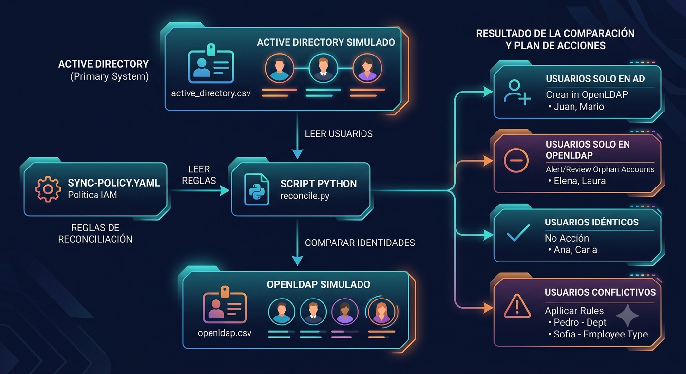
Resultado:
- Usuarios solo en Active Directory
- Usuarios solo en OpenLDAP
- Usuarios idénticos
- Usuarios conflictivos
- Plan de acciones de reconciliación

## Duración aproximada

**30 minutos**

---

## Tabla de ayuda

| Elemento | Descripción |
|--------|------------|
| Plataforma | Windows Server en máquina virtual de Azure |
| Lenguaje | Python 3.12 |
| Terminal | Windows PowerShell |
| Archivos de datos | CSV |
| Archivo de política | YAML |
| Librerías | PyYAML, tabulate |
| Objetivo técnico | Comparar usuarios entre dos repositorios simulados |
| Tipo de práctica | Aprovisionamiento, sincronización y reconciliación |

---

## Instrucciones

---

### Tarea 1. Comprender el escenario del laboratorio

En esta práctica trabajarás con una empresa ficticia llamada **GlobalCorp**.

GlobalCorp tiene dos repositorios de identidad:

| Sistema | Descripción | Archivo usado |
|--------|------------|--------------|
| Active Directory simulado | Sistema principal donde se registran los usuarios activos | `active_directory.csv` |
| OpenLDAP simulado | Directorio secundario o legacy usado por aplicaciones antiguas | `openldap.csv` |

El problema es que ambos repositorios no siempre tienen la misma información.

Durante el laboratorio identificarás cuatro situaciones:

| Situación | Significado |
|---------|------------|
| Usuario solo en Active Directory | Usuario que debe aprovisionarse en OpenLDAP |
| Usuario solo en OpenLDAP | Posible cuenta huérfana, legacy o usuario dado de baja |
| Usuario idéntico | Usuario correctamente sincronizado |
| Usuario conflictivo | Usuario que existe en ambos sistemas, pero con datos diferentes |

---

#### ¿Sabías que…?
**Concepto: Aprovisionamiento**

El aprovisionamiento es el proceso de crear una identidad o cuenta en un sistema.

Ejemplo: si `juan@globalcorp.com` existe en Active Directory, pero no existe en OpenLDAP, el sistema puede generar una acción para crear ese usuario en OpenLDAP.

---

#### ¿Sabías que…?
**Concepto: Reconciliación**

La reconciliación consiste en comparar dos o más repositorios de identidad para detectar diferencias.

Ejemplo: Active Directory indica que Pedro pertenece al departamento `RH`, pero OpenLDAP indica que pertenece a `Operaciones`.

Ese caso requiere una regla para decidir qué valor debe prevalecer.

---

### Tarea 2. Validar que Python esté instalado

Antes de crear los archivos del laboratorio, valida que Python y pip estén funcionando.

Paso 1. Abrir **Windows PowerShell como administrador**.

*Opcional: Buscar el nombre exacto del paquete*

Ejecuta:

```powershell
winget search python --source winget
```
Si aparece algo como:
Python 3.13    Python.Python.3.13
Python 3.12    Python.Python.3.12
Python 3.11    Python.Python.3.11

Instala el que aparezca. Por ejemplo:
```powershell
winget install --id Python.Python.3.13 -e --source winget
```
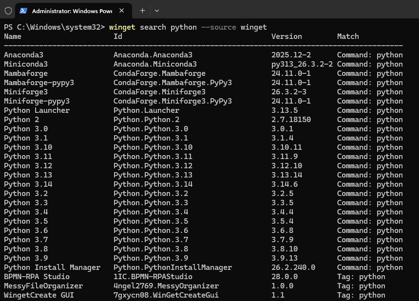

Espera a que se instale debera aparecer Succefully
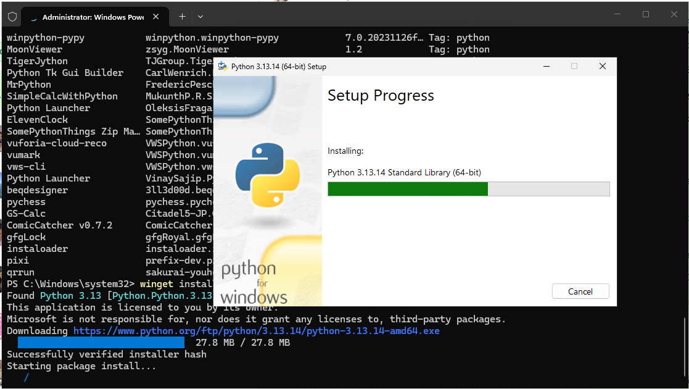

Paso 2. Ejecutar el siguiente comando:
**IMPORTANTE : CIERRA Y ABRE NUEVAMENTE POWERSHELL**
```powershell
python --version
```

Resultado esperado:

```text
Python 3.13.14
```

Paso 3. Validar pip:

```powershell
pip --version
```

Resultado esperado:

```text
pip 26.1.2
```
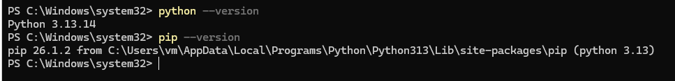
Si ambos comandos responden correctamente, continúa con la siguiente tarea.

---

#### ¿Sabías que…?
**Concepto: Python**

Python es un lenguaje de programación usado frecuentemente para automatización, análisis de datos, scripts administrativos e integración entre sistemas.

En este laboratorio se usa Python para leer usuarios desde archivos CSV, comparar datos y generar un reporte.

---

### Tarea 3. Crear la estructura del laboratorio

En esta tarea crearás la carpeta principal y las subcarpetas donde se guardarán los archivos del laboratorio.

Paso 1. En PowerShell, ir a la unidad `C:\`:

```powershell
cd C:\
```

Paso 2. Crear la carpeta general de laboratorios:

```powershell
New-Item -ItemType Directory -Force -Path C:\labs
```

Paso 3. Entrar a la carpeta:

```powershell
cd C:\labs
```
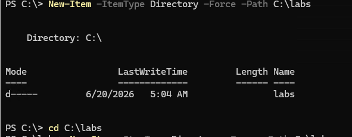

Paso 4. Crear la carpeta del laboratorio:

```powershell
New-Item -ItemType Directory -Force -Path .\lab-identity-reconciliation
```

Paso 5. Entrar a la carpeta del laboratorio:

```powershell
cd .\lab-identity-reconciliation
```

Paso 6. Crear las carpetas internas:

```powershell
New-Item -ItemType Directory -Force -Path .\data
New-Item -ItemType Directory -Force -Path .\policy
New-Item -ItemType Directory -Force -Path .\scripts
```

Paso 7. Validar la estructura:

```powershell
dir
```

Resultado esperado:

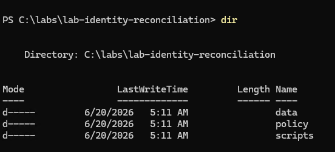

---

#### ¿Sabías que…?
**Concepto: Estructura del laboratorio**

La práctica usará esta organización:

```text
lab-identity-reconciliation/
│
├── data/
│   ├── active_directory.csv
│   └── openldap.csv
│
├── policy/
│   └── sync-policy.yaml
│
└── scripts/
    └── reconcile.py
```

Cada carpeta cumple una función:

| Carpeta | Función |
|--------|--------|
| `data` | Guarda los usuarios simulados |
| `policy` | Guarda las reglas de reconciliación |
| `scripts` | Guarda el script que compara los datos |

---

### Tarea 4. Crear y activar un entorno virtual de Python

En esta tarea crearás un entorno aislado para instalar las librerías del laboratorio.

Paso 1. Crear el entorno virtual:

```powershell
python -m venv venv
```

Paso 2. Activar el entorno virtual:

```powershell
.\venv\Scripts\Activate.ps1
```

Resultado esperado:

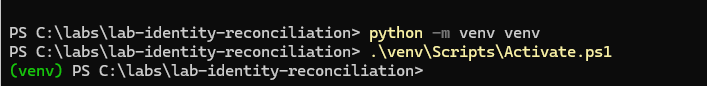

Si PowerShell bloquea la ejecución, ejecutar:

```powershell
Set-ExecutionPolicy -ExecutionPolicy RemoteSigned -Scope CurrentUser
```

Cuando pregunte confirmación, escribir:

```text
Y
```

Luego volver a ejecutar:

```powershell
.\venv\Scripts\Activate.ps1
```

---

#### ¿Sabías que…?
**Concepto: Entorno virtual**

Un entorno virtual permite instalar librerías solo para este laboratorio, sin afectar la instalación general de Python en la máquina.

Esto es útil porque cada práctica puede tener sus propias dependencias.

---

### Tarea 5. Instalar las librerías necesarias

En esta tarea instalarás las librerías que usará el script.

Paso 1. Con el entorno virtual activo, ejecutar:

```powershell
pip install pyyaml tabulate
```

Paso 2. Validar la instalación:

```powershell
pip list
```

Debes ver librerías similares a:

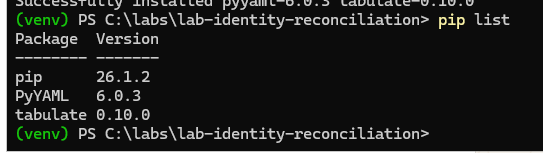

---

#### ¿Sabías que…?
**Concepto: PyYAML**

PyYAML permite que Python lea archivos `.yaml`.

En este laboratorio, el archivo YAML contiene las reglas de reconciliación.

---

#### ¿Sabías que…?
**Concepto: tabulate**

La librería `tabulate` permite imprimir tablas legibles en la consola.

Se usa para mostrar el resumen de discrepancias y el plan de acciones.

---

### Tarea 6. Crear el archivo de Active Directory simulado

En esta tarea crearás un archivo CSV que representa el sistema principal de identidades.

Paso 1. Ejecutar el siguiente comando:

```powershell
@"
email,full_name,department,employee_type,status
ana@globalcorp.com,Ana Torres,Finanzas,FTE,active
juan@globalcorp.com,Juan Garcia,TI,FTE,active
pedro@globalcorp.com,Pedro Lopez,RH,FTE,active
sofia@globalcorp.com,Sofia Martinez,Marketing,Contractor,active
mario@globalcorp.com,Mario Rojas,Soporte,Contractor,active
carla@globalcorp.com,Carla Mendez,Legal,FTE,active
"@ | Set-Content -Path .\data\active_directory.csv -Encoding UTF8
```

Paso 2. Validar el contenido:

```powershell
type .\data\active_directory.csv
```
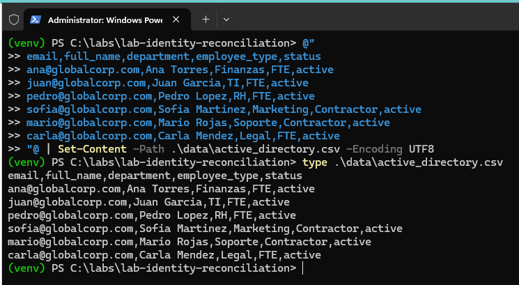
---

#### ¿Sabías que…?
**Concepto: Active Directory como fuente principal**

En muchos entornos empresariales, Active Directory o Microsoft Entra ID funcionan como repositorios principales de identidad.

En este laboratorio, Active Directory simulado será tratado como la fuente principal para ciertos atributos.

---

### Tarea 7. Crear el archivo de OpenLDAP simulado

En esta tarea crearás el archivo que representa el directorio secundario o legacy.

Paso 1. Ejecutar:

```powershell
@"
email,full_name,department,employee_type,status
ana@globalcorp.com,Ana Torres,Finanzas,FTE,active
laura@globalcorp.com,Laura Perez,Ventas,FTE,active
pedro@globalcorp.com,Pedro Lopez,Operaciones,FTE,active
sofia@globalcorp.com,Sofia Martinez,Marketing,FTE,active
elena@globalcorp.com,Elena Ruiz,TI,Contractor,active
carla@globalcorp.com,Carla Mendez,Legal,FTE,active
"@ | Set-Content -Path .\data\openldap.csv -Encoding UTF8
```

Paso 2. Validar el contenido:

```powershell
type .\data\openldap.csv
```

---

#### ¿Sabías que…?
**Concepto: Directorio legacy**

Un directorio legacy es un sistema antiguo que todavía es usado por aplicaciones existentes.

Aunque ya no sea el sistema principal, puede contener cuentas activas, antiguas o inconsistentes.

---

### Tarea 8. Crear la política de reconciliación

En esta tarea crearás el archivo YAML que define las reglas de decisión.

Paso 1. Ejecutar:

```powershell
@"
metadata:
  policy_name: "globalcorp-identity-reconciliation"
  version: "1.0"
  description: "Politica basica de aprovisionamiento y reconciliacion entre Active Directory y OpenLDAP simulados"

correlation:
  key_attribute: "email"
  matching_strategy: "exact_match"

authoritative_sources:
  full_name: "active_directory"
  department: "active_directory"
  employee_type: "manual_review"
  status: "active_directory"

reconciliation_policy:
  only_in_active_directory:
    action: "create_in_openldap"
    reason: "Usuario nuevo detectado en el sistema principal. Debe aprovisionarse en el directorio secundario."

  only_in_openldap:
    action: "alert"
    reason: "Usuario existe solo en el directorio secundario. Puede ser una cuenta huerfana, legacy o de un usuario dado de baja."

  identical:
    action: "no_action"
    reason: "La identidad esta correctamente sincronizada."

  conflicting:
    action: "apply_attribute_rules"
    reason: "Existen diferencias de atributos. Se aplican reglas segun fuente de verdad."

attribute_rules:
  full_name:
    on_conflict: "use_active_directory"

  department:
    on_conflict: "use_active_directory"

  employee_type:
    on_conflict: "alert"

  status:
    on_conflict: "use_active_directory"

execution:
  dry_run: true
"@ | Set-Content -Path .\policy\sync-policy.yaml -Encoding UTF8
```

Paso 2. Validar el archivo:

```powershell
type .\policy\sync-policy.yaml
```

---

#### ¿Sabías que…?
**Concepto: Fuente de verdad**

Una fuente de verdad es el sistema que se considera confiable para un dato específico.

Ejemplo:

```text
Active Directory: department = RH
OpenLDAP: department = Operaciones
```

La política puede definir que Active Directory tiene prioridad.

---

#### ¿Sabías que…?
**Concepto: Revisión manual**

No todos los datos deben corregirse automáticamente.

En este laboratorio, `employee_type` genera una alerta porque cambiar el tipo de empleado podría afectar permisos y accesos.

---

### Tarea 9. Crear el script de reconciliación

En esta tarea crearás el script Python que compara los usuarios y genera el reporte.

> Nota importante:
> Este script fue diseñado para evitar errores comunes de escritura en Python. Por eso no usa la línea `if __name__ == "__main__":`.

Paso 1. Ejecutar:

```powershell
@'
import csv
import yaml
from tabulate import tabulate

AD_FILE = "data/active_directory.csv"
LDAP_FILE = "data/openldap.csv"
POLICY_FILE = "policy/sync-policy.yaml"

def read_csv(path):
    with open(path, "r", encoding="utf-8-sig") as file:
        rows = csv.DictReader(file)
        return {row["email"].strip().lower(): row for row in rows}

def read_policy(path):
    with open(path, "r", encoding="utf-8-sig") as file:
        return yaml.safe_load(file)

policy = read_policy(POLICY_FILE)
ad = read_csv(AD_FILE)
ldap = read_csv(LDAP_FILE)

only_ad = []
only_ldap = []
identical = []
conflicting = []

all_users = sorted(set(ad.keys()) | set(ldap.keys()))

for email in all_users:
    if email in ad and email not in ldap:
        only_ad.append(email)

    elif email in ldap and email not in ad:
        only_ldap.append(email)

    else:
        conflicts = []

        for field in ["full_name", "department", "employee_type", "status"]:
            if ad[email][field] != ldap[email][field]:
                conflicts.append((field, ad[email][field], ldap[email][field]))

        if conflicts:
            conflicting.append((email, conflicts))
        else:
            identical.append(email)

summary = [
    ["Solo en Active Directory", len(only_ad)],
    ["Solo en OpenLDAP", len(only_ldap)],
    ["Identicos", len(identical)],
    ["Conflictivos", len(conflicting)]
]

actions = []

for email in only_ad:
    actions.append([
        email,
        "Solo en AD",
        policy["reconciliation_policy"]["only_in_active_directory"]["action"],
        "Crear usuario en OpenLDAP"
    ])

for email in only_ldap:
    actions.append([
        email,
        "Solo en OpenLDAP",
        policy["reconciliation_policy"]["only_in_openldap"]["action"],
        "Revisar posible cuenta huerfana o legacy"
    ])

for email in identical:
    actions.append([
        email,
        "Identico",
        policy["reconciliation_policy"]["identical"]["action"],
        "No hacer nada"
    ])

for email, conflicts in conflicting:
    for field, ad_value, ldap_value in conflicts:
        rule = policy["attribute_rules"][field]["on_conflict"]

        if rule == "use_active_directory":
            detail = f"Actualizar {field}: {ldap_value} -> {ad_value}"
        else:
            detail = f"{field}: AD={ad_value}, LDAP={ldap_value}"

        actions.append([
            email,
            "Conflictivo",
            rule,
            detail
        ])

print()
print("REPORTE DE APROVISIONAMIENTO Y RECONCILIACION")
print("=" * 60)
print(f"Politica: {policy['metadata']['policy_name']}")
print(f"Version: {policy['metadata']['version']}")
print(f"Modo dry-run: {policy['execution']['dry_run']}")
print("=" * 60)
print()
print("RESUMEN DE DISCREPANCIAS")
print(tabulate(summary, headers=["Categoria", "Cantidad"], tablefmt="grid"))
print()
print("PLAN DE ACCIONES")
print("=" * 60)
print(tabulate(actions, headers=["Usuario", "Categoria", "Accion", "Detalle"], tablefmt="grid"))
'@ | Set-Content -Path .\scripts\reconcile.py -Encoding UTF8
```

Paso 2. Validar que el archivo fue creado:

```powershell
dir .\scripts
```

Resultado esperado:

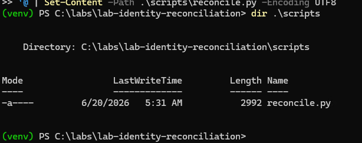

---

### Tarea 10. Ejecutar el laboratorio

En esta tarea ejecutarás el script y revisarás el resultado.

Paso 1. Ejecutar:

```powershell
python .\scripts\reconcile.py
```

Paso 2. Revisar el resumen generado.

Resultado esperado:

```text
REPORTE DE APROVISIONAMIENTO Y RECONCILIACION
============================================================
Politica: globalcorp-identity-reconciliation
Version: 1.0
Modo dry-run: True
============================================================

RESUMEN DE DISCREPANCIAS

+--------------------------+------------+
| Categoria                |   Cantidad |
+==========================+============+
| Solo en Active Directory |          2 |
| Solo en OpenLDAP         |          2 |
| Identicos                |          2 |
| Conflictivos             |          2 |
+--------------------------+------------+
```

Paso 3. Revisar el plan de acciones.

Resultado esperado:

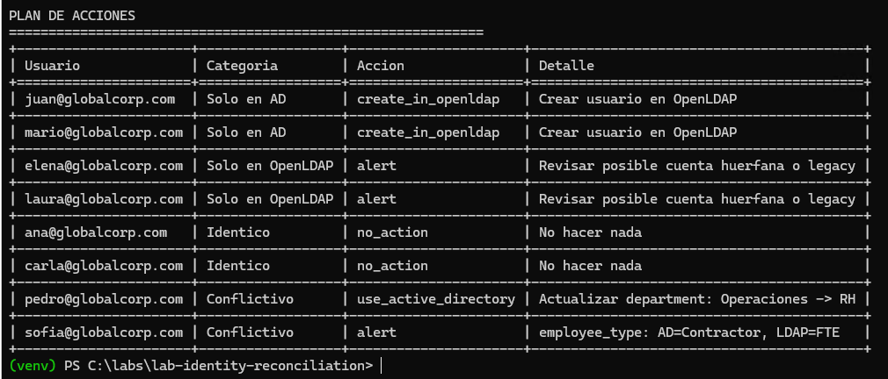

---

#### ¿Sabías que…?
**Concepto: Dry run**

`dry_run` significa que el script simula las acciones, pero no modifica ningún sistema.

En un entorno real, este modo permite revisar qué cambios se aplicarían antes de ejecutarlos.

---

## Interpretación del laboratorio

### Usuarios solo en Active Directory

Usuarios detectados:

```text
juan@globalcorp.com
mario@globalcorp.com
```

Interpretación:

Estos usuarios existen en el sistema principal, pero no en OpenLDAP.

Acción:

```text
create_in_openldap
```

Esto representa un caso de aprovisionamiento.

---

### Usuarios solo en OpenLDAP

Usuarios detectados:

```text
elena@globalcorp.com
laura@globalcorp.com
```

Interpretación:

Estos usuarios existen en el directorio secundario, pero no existen en el sistema principal.

Acción:

```text
alert
```

Esto puede representar una cuenta huérfana, legacy o un posible usuario dado de baja.

---

### Usuarios idénticos

Usuarios detectados:

```text
ana@globalcorp.com
carla@globalcorp.com
```

Interpretación:

Estos usuarios existen en ambos repositorios y tienen los mismos datos.

Acción:

```text
no_action
```

No se requieren cambios.

---

### Usuarios conflictivos

Usuarios detectados:

```text
pedro@globalcorp.com
sofia@globalcorp.com
```

Pedro tiene un conflicto en el departamento:

```text
Active Directory: RH
OpenLDAP: Operaciones
```

Acción:

```text
use_active_directory
```

Esto significa que Active Directory es la fuente de verdad para el atributo `department`.

Sofía tiene un conflicto en el tipo de empleado:

```text
Active Directory: Contractor
OpenLDAP: FTE
```

Acción:

```text
alert
```

Este dato requiere revisión manual porque puede afectar permisos y accesos.

---

## Actividad de cierre

Responde las siguientes preguntas:

1. ¿Qué usuarios deben ser creados en OpenLDAP?
2. ¿Qué usuarios requieren revisión manual?
3. ¿Qué usuarios están correctamente sincronizados?
4. ¿Qué usuario representa un conflicto de departamento?
5. ¿Qué usuario representa un conflicto de tipo de empleado?
6. ¿Por qué `employee_type` genera una alerta?
7. ¿Qué significa que Active Directory sea la fuente de verdad?
8. ¿Qué caso representa un posible Joiner?
9. ¿Qué caso representa un posible Leaver?
10. ¿Qué caso representa un posible Mover?

---

## Respuestas esperadas

1. Juan y Mario.
2. Elena, Laura y Sofía.
3. Ana y Carla.
4. Pedro.
5. Sofía.
6. Porque el tipo de empleado puede afectar permisos y accesos.
7. Que el valor de Active Directory tiene prioridad sobre el valor de OpenLDAP.
8. Usuarios solo en Active Directory.
9. Usuarios solo en OpenLDAP.
10. Usuario con cambio de departamento, como Pedro.

---

## Conclusiones

En este laboratorio se simuló un proceso básico de aprovisionamiento y reconciliación de identidades entre dos repositorios.

### Puntos clave aprendidos

- El aprovisionamiento permite crear usuarios faltantes en sistemas secundarios.
- La reconciliación permite comparar repositorios y detectar diferencias.
- La sincronización ayuda a mantener atributos consistentes entre sistemas.
- No todos los conflictos deben resolverse automáticamente.
- Una fuente de verdad define qué sistema tiene prioridad para un atributo.
- Las cuentas que existen solo en un sistema secundario pueden representar riesgos.
- El modo `dry_run` permite revisar acciones antes de aplicarlas.
- El ciclo de vida de identidades puede observarse en casos como:
  - Joiner: usuario nuevo en Active Directory.
  - Mover: usuario con cambio de departamento.
  - Leaver: usuario que podría haber salido de la organización.

Este laboratorio demuestra que gestionar identidades no consiste solo en crear usuarios, sino en tomar decisiones controladas sobre sincronización, revisión manual y confianza en los datos.

### Fin del laboratorio 2.3
