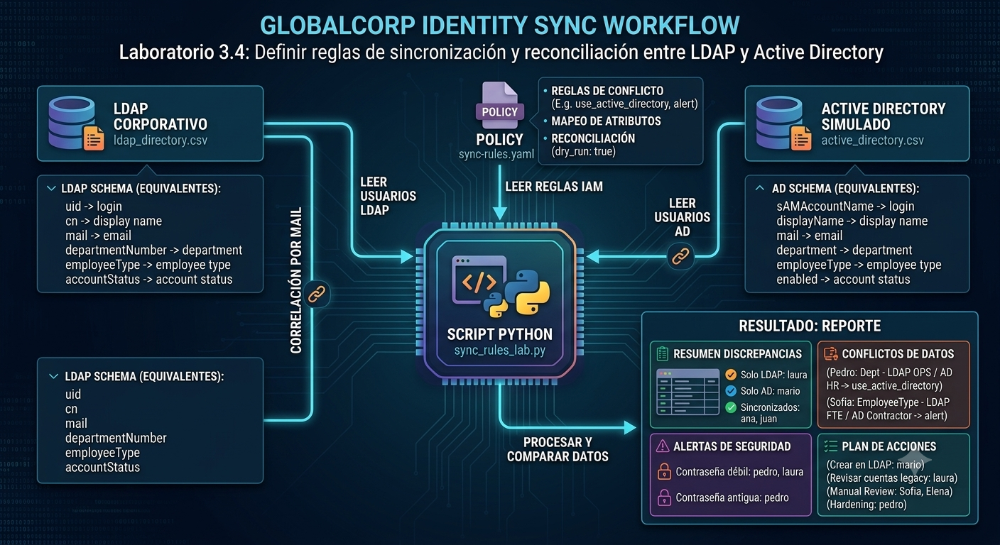
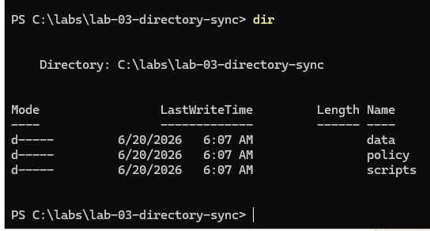
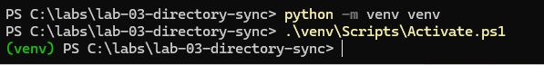
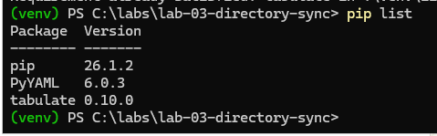
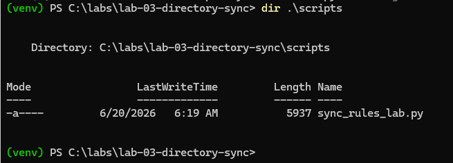

# Laboratorio 3.4: Definir reglas de sincronización y reconciliación entre LDAP y Active Directory

## Objetivo de la práctica

Al finalizar la práctica, serás capaz de:

- Comprender cómo se relacionan LDAP y Active Directory como servicios de directorio.
- Identificar diferencias de esquema entre LDAP y Active Directory.
- Definir reglas de sincronización entre atributos equivalentes.
- Detectar conflictos de datos entre dos repositorios.
- Aplicar reglas de reconciliación según una política YAML.
- Revisar controles básicos de hardening y políticas de contraseñas.
- Generar un reporte con acciones recomendadas de sincronización, reconciliación y seguridad.

---

## Objetivo visual

Representar el flujo de comparación entre un directorio LDAP y un Active Directory simulado, aplicando reglas de sincronización y controles básicos de seguridad.



Resultado:
- Usuarios solo en LDAP
- Usuarios solo en Active Directory
- Usuarios sincronizados
- Conflictos de datos
- Alertas de seguridad
- Plan de acciones


## Duración aproximada

**31 minutos**

## Tabla de ayuda

| Elemento | Descripción |
|--------|------------|
| Plataforma | Windows Server en máquina virtual de Azure |
| Terminal | Windows PowerShell |
| Lenguaje | Python 3.12 |
| Archivos de datos | CSV |
| Archivo de reglas | YAML |
| Librerías | PyYAML, tabulate |
| Tema principal | Servicios de directorio y sincronización |
| Servicios simulados | LDAP Corporativo y Active Directory |
| Tipo de práctica | Sincronización, reconciliación, conflictos y hardening básico |

---

## Instrucciones

---

### Tarea 1. Comprender el escenario del laboratorio

En esta práctica trabajarás con una empresa ficticia llamada **GlobalCorp**.

GlobalCorp tiene dos servicios de directorio:

| Directorio | Archivo usado | Rol |
|----------|---------------|-----|
| LDAP Corporativo | `ldap_directory.csv` | Directorio usado por aplicaciones internas |
| Active Directory | `active_directory.csv` | Directorio principal corporativo |

Ambos directorios almacenan usuarios, pero no usan exactamente los mismos nombres de atributos.

| Concepto | LDAP | Active Directory |
|--------|------|------------------|
| Usuario/login | `uid` | `sAMAccountName` |
| Nombre visible | `cn` | `displayName` |
| Correo | `mail` | `mail` |
| Departamento | `departmentNumber` | `department` |
| Tipo de empleado | `employeeType` | `employeeType` |
| Estado de cuenta | `accountStatus` | `enabled` |

El objetivo es definir reglas que permitan comparar ambos repositorios, detectar diferencias y decidir qué acción tomar.

---

#### ¿Sabías que…?
**Concepto: Servicio de directorio**

Un servicio de directorio permite almacenar, organizar y consultar identidades, grupos, atributos y recursos de una organización.

LDAP es un protocolo común para consultar directorios. Active Directory implementa servicios de directorio y expone compatibilidad con LDAP, además de integrar autenticación, políticas y administración centralizada.

---

#### ¿Sabías que…?
**Concepto: Esquema de directorio**

El esquema define qué atributos puede tener una identidad.

Ejemplo:

- En LDAP, el nombre visible puede estar en `cn`.
- En Active Directory, el nombre visible puede estar en `displayName`.

Aunque representan el mismo dato, los nombres técnicos son diferentes. Por eso se necesitan reglas de mapeo.

---

### Tarea 2. Validar que Python esté instalado

Antes de crear los archivos del laboratorio, valida que Python y pip estén funcionando(Lo instalamos en Laboratorio 2.3).

Paso 1. Abrir **Windows PowerShell**.

Paso 2. Ejecutar:

```powershell
python --version
```

Resultado esperado:

```text
Python 3.13.14
```

Paso 3. Validar pip:

```powershell
pip --version
```

Resultado esperado:

```text
pip 26.1.2
```

Si ambos comandos responden correctamente, continúa con la siguiente tarea.

---

### Tarea 3. Crear la estructura del laboratorio

En esta tarea crearás la carpeta principal y las subcarpetas donde se guardarán los archivos del laboratorio.

Paso 1. En PowerShell, ir a la unidad `C:\`:

```powershell
cd C:\
```

Paso 2. Crear la carpeta general de laboratorios:

```powershell
New-Item -ItemType Directory -Force -Path C:\labs
```

Paso 3. Entrar a la carpeta:

```powershell
cd C:\labs
```

Paso 4. Crear la carpeta del laboratorio:

```powershell
New-Item -ItemType Directory -Force -Path .\lab-03-directory-sync
```

Paso 5. Entrar a la carpeta del laboratorio:

```powershell
cd .\lab-03-directory-sync
```

Paso 6. Crear las carpetas internas:

```powershell
New-Item -ItemType Directory -Force -Path .\data
New-Item -ItemType Directory -Force -Path .\policy
New-Item -ItemType Directory -Force -Path .\scripts
```

Paso 7. Validar la estructura:

```powershell
dir
```

Resultado esperado:


---

#### ¿Sabías que…?
**Concepto: Estructura del laboratorio**

La práctica usará esta organización:

```text
lab-03-directory-sync/
│
├── data/
│   ├── ldap_directory.csv
│   └── active_directory.csv
│
├── policy/
│   └── sync-rules.yaml
│
└── scripts/
    └── sync_rules_lab.py
```

Cada carpeta cumple una función:

| Carpeta | Función |
|--------|--------|
| `data` | Guarda los usuarios simulados |
| `policy` | Guarda las reglas de sincronización y reconciliación |
| `scripts` | Guarda el script que compara los datos |


---

### Tarea 4. Crear y activar un entorno virtual de Python

En esta tarea crearás un entorno aislado para instalar las librerías del laboratorio.

Paso 1. Crear el entorno virtual:

```powershell
python -m venv venv
```

Paso 2. Activar el entorno virtual:

```powershell
.\venv\Scripts\Activate.ps1
```

Resultado esperado:



Si PowerShell bloquea la ejecución, ejecutar:

```powershell
Set-ExecutionPolicy -ExecutionPolicy RemoteSigned -Scope CurrentUser
```

Cuando pregunte confirmación, escribir:

```text
Y
```

Luego volver a ejecutar:

```powershell
.\venv\Scripts\Activate.ps1
```

---

#### ¿Sabías que…?
**Concepto: Entorno virtual**

Un entorno virtual permite instalar librerías solo para este laboratorio, sin afectar la instalación general de Python en la máquina.

Esto ayuda a mantener cada práctica aislada y controlada.

---

### Tarea 5. Instalar las librerías necesarias

En esta tarea instalarás las librerías que usará el script.

Paso 1. Con el entorno virtual activo, ejecutar:

```powershell
pip install pyyaml tabulate
```

Paso 2. Validar la instalación:

```powershell
pip list
```

Debes ver librerías similares a:



---

#### ¿Sabías que…?
**Concepto: PyYAML**

PyYAML permite que Python lea archivos `.yaml`.

En este laboratorio, el archivo YAML contiene las reglas de sincronización, reconciliación y seguridad.

---

#### ¿Sabías que…?
**Concepto: tabulate**

La librería `tabulate` permite imprimir tablas legibles en la consola.

Se usa para mostrar el resumen, el plan de acciones y las alertas de seguridad.

---

### Tarea 6. Crear los datos del directorio LDAP

En esta tarea crearás un archivo CSV que representa el directorio LDAP corporativo.

Paso 1. Ejecutar el siguiente comando:

```powershell
@"
uid,cn,mail,departmentNumber,employeeType,accountStatus,passwordPolicy,lastPasswordChange
atorres,Ana Torres,ana@globalcorp.com,FIN,FTE,active,strong,2026-05-20
jgarcia,Juan Garcia,juan@globalcorp.com,IT,FTE,active,strong,2026-05-28
plopez,Pedro Lopez,pedro@globalcorp.com,OPS,FTE,active,weak,2025-12-10
smartinez,Sofia Martinez,sofia@globalcorp.com,MKT,FTE,active,strong,2026-05-30
lruiz,Laura Ruiz,laura@globalcorp.com,SALES,Contractor,active,weak,2026-01-15
"@ | Set-Content -Path .\data\ldap_directory.csv -Encoding UTF8
```

Paso 2. Validar el contenido:

```powershell
type .\data\ldap_directory.csv
```

---

#### ¿Sabías que…?
**Concepto: LDAP**

LDAP es un protocolo usado para consultar y administrar información en servicios de directorio.

En este laboratorio, LDAP representa un directorio corporativo usado por aplicaciones internas.

---

### Tarea 7. Crear los datos de Active Directory

En esta tarea crearás un archivo CSV que representa el directorio Active Directory.

Paso 1. Ejecutar:

```powershell
@"
sAMAccountName,displayName,mail,department,employeeType,enabled,passwordPolicy,lastPasswordChange
atorres,Ana Torres,ana@globalcorp.com,FIN,FTE,true,strong,2026-05-20
jgarcia,Juan Garcia,juan@globalcorp.com,IT,FTE,true,strong,2026-05-28
plopez,Pedro Lopez,pedro@globalcorp.com,HR,FTE,true,strong,2026-05-29
smartinez,Sofia Martinez,sofia@globalcorp.com,MKT,Contractor,true,strong,2026-05-30
mrojas,Mario Rojas,mario@globalcorp.com,SUPPORT,Contractor,true,strong,2026-06-01
"@ | Set-Content -Path .\data\active_directory.csv -Encoding UTF8
```

Paso 2. Validar el contenido:

```powershell
type .\data\active_directory.csv
```

---

#### ¿Sabías que…?
**Concepto: Active Directory**

Active Directory es un servicio de directorio de Microsoft usado para administrar usuarios, grupos, equipos, políticas y autenticación dentro de una organización.

En este laboratorio, Active Directory se trata como el sistema principal para ciertos atributos.


---

### Tarea 8. Crear la política de sincronización y reconciliación

En esta tarea crearás el archivo YAML que define las reglas de decisión.

Paso 1. Ejecutar:

```powershell
@"
metadata:
  policy_name: "globalcorp-directory-sync-rules"
  version: "1.0"
  description: "Reglas de sincronizacion y reconciliacion entre LDAP y Active Directory simulados"

correlation:
  key_attribute: "mail"
  matching_strategy: "exact_match"

attribute_mapping:
  login:
    ldap_attr: "uid"
    ad_attr: "sAMAccountName"
    sync_direction: "ad_to_ldap"
    on_conflict: "alert"

  display_name:
    ldap_attr: "cn"
    ad_attr: "displayName"
    sync_direction: "ad_to_ldap"
    on_conflict: "use_active_directory"

  email:
    ldap_attr: "mail"
    ad_attr: "mail"
    sync_direction: "bidirectional"
    on_conflict: "alert"

  department:
    ldap_attr: "departmentNumber"
    ad_attr: "department"
    sync_direction: "ad_to_ldap"
    on_conflict: "use_active_directory"

  employee_type:
    ldap_attr: "employeeType"
    ad_attr: "employeeType"
    sync_direction: "manual_review"
    on_conflict: "alert"

  account_status:
    ldap_attr: "accountStatus"
    ad_attr: "enabled"
    sync_direction: "ad_to_ldap"
    on_conflict: "use_active_directory"

reconciliation_policy:
  only_in_ldap:
    action: "alert"
    reason: "La identidad existe solo en LDAP. Puede ser una cuenta legacy, huerfana o de un usuario dado de baja."

  only_in_active_directory:
    action: "create_in_ldap"
    reason: "La identidad existe en Active Directory pero no en LDAP. Puede requerir aprovisionamiento en aplicaciones legacy."

  identical:
    action: "no_action"
    reason: "La identidad esta sincronizada."

  conflicting:
    action: "apply_attribute_rules"
    reason: "Existen diferencias de atributos. Se aplican reglas de sincronizacion por atributo."

security_policy:
  minimum_password_policy: "strong"
  max_password_age_days: 180
  weak_password_action: "alert"
  old_password_action: "alert"

execution:
  dry_run: true
"@ | Set-Content -Path .\policy\sync-rules.yaml -Encoding UTF8
```

Paso 2. Validar el archivo:

```powershell
type .\policy\sync-rules.yaml
```

---

#### ¿Sabías que…?
**Concepto: Correlación**

La correlación permite determinar si una identidad en LDAP y una identidad en Active Directory representan a la misma persona.

En este laboratorio se usa el atributo `mail`.

Ejemplo:

```text
pedro@globalcorp.com en LDAP = pedro@globalcorp.com en Active Directory
```

---

#### ¿Sabías que…?
**Concepto: Mapeo de atributos**

El mapeo permite relacionar atributos equivalentes con nombres diferentes.

Ejemplo:

```text
LDAP: cn
Active Directory: displayName
```

Ambos pueden representar el nombre visible del usuario.

---

#### ¿Sabías que…?
**Concepto: Regla de conflicto**

Una regla de conflicto define qué acción tomar cuando los valores no coinciden.

Ejemplo:

```text
LDAP: departmentNumber = OPS
Active Directory: department = HR
```

La política puede indicar que Active Directory tiene prioridad.

---

### Tarea 9. Crear el script de sincronización y reconciliación

En esta tarea crearás el script Python que compara usuarios, aplica reglas y genera un reporte.

Paso 1. Ejecutar:

```powershell
@'
import csv
import yaml
from datetime import datetime
from tabulate import tabulate

LDAP_FILE = "data/ldap_directory.csv"
AD_FILE = "data/active_directory.csv"
POLICY_FILE = "policy/sync-rules.yaml"

TODAY = datetime(2026, 6, 13)

def read_csv(path):
    with open(path, "r", encoding="utf-8-sig") as file:
        rows = csv.DictReader(file)
        return {row["mail"].strip().lower(): row for row in rows}

def read_policy(path):
    with open(path, "r", encoding="utf-8-sig") as file:
        return yaml.safe_load(file)

def days_since(date_text):
    date_value = datetime.strptime(date_text, "%Y-%m-%d")
    return (TODAY - date_value).days

policy = read_policy(POLICY_FILE)
ldap = read_csv(LDAP_FILE)
ad = read_csv(AD_FILE)

attribute_mapping = policy["attribute_mapping"]
security_policy = policy["security_policy"]

only_ldap = []
only_ad = []
identical = []
conflicts = []
security_alerts = []

all_users = sorted(set(ldap.keys()) | set(ad.keys()))

for mail in all_users:
    in_ldap = mail in ldap
    in_ad = mail in ad

    if in_ldap and not in_ad:
        only_ldap.append(mail)

    elif in_ad and not in_ldap:
        only_ad.append(mail)

    else:
        user_conflicts = []

        for rule_name, rule in attribute_mapping.items():
            ldap_attr = rule["ldap_attr"]
            ad_attr = rule["ad_attr"]

            ldap_value = ldap[mail][ldap_attr]
            ad_value = ad[mail][ad_attr]

            if rule_name == "account_status":
                ad_value = "active" if ad_value.lower() == "true" else "disabled"

            if ldap_value != ad_value:
                user_conflicts.append([
                    mail,
                    rule_name,
                    ldap_attr,
                    ldap_value,
                    ad_attr,
                    ad_value,
                    rule["on_conflict"]
                ])

        if user_conflicts:
            conflicts.extend(user_conflicts)
        else:
            identical.append(mail)

for mail, user in ldap.items():
    if user["passwordPolicy"].lower() != security_policy["minimum_password_policy"]:
        security_alerts.append([
            mail,
            "LDAP",
            "Politica de password debil",
            f"passwordPolicy={user['passwordPolicy']}",
            security_policy["weak_password_action"]
        ])

    age = days_since(user["lastPasswordChange"])
    if age > security_policy["max_password_age_days"]:
        security_alerts.append([
            mail,
            "LDAP",
            "Password antigua",
            f"{age} dias desde ultimo cambio",
            security_policy["old_password_action"]
        ])

for mail, user in ad.items():
    if user["passwordPolicy"].lower() != security_policy["minimum_password_policy"]:
        security_alerts.append([
            mail,
            "Active Directory",
            "Politica de password debil",
            f"passwordPolicy={user['passwordPolicy']}",
            security_policy["weak_password_action"]
        ])

    age = days_since(user["lastPasswordChange"])
    if age > security_policy["max_password_age_days"]:
        security_alerts.append([
            mail,
            "Active Directory",
            "Password antigua",
            f"{age} dias desde ultimo cambio",
            security_policy["old_password_action"]
        ])

action_plan = []

for mail in only_ldap:
    action_plan.append([
        mail,
        "Solo en LDAP",
        policy["reconciliation_policy"]["only_in_ldap"]["action"],
        "Revisar cuenta legacy, huerfana o posible baja"
    ])

for mail in only_ad:
    action_plan.append([
        mail,
        "Solo en Active Directory",
        policy["reconciliation_policy"]["only_in_active_directory"]["action"],
        "Crear usuario en LDAP si requiere apps legacy"
    ])

for mail in identical:
    action_plan.append([
        mail,
        "Sincronizado",
        policy["reconciliation_policy"]["identical"]["action"],
        "No se requieren cambios"
    ])

for item in conflicts:
    mail = item[0]
    rule_name = item[1]
    ldap_attr = item[2]
    ldap_value = item[3]
    ad_attr = item[4]
    ad_value = item[5]
    action = item[6]

    if action == "use_active_directory":
        detail = f"Actualizar LDAP {ldap_attr}: {ldap_value} -> {ad_value}"
    elif action == "alert":
        detail = f"Revisar conflicto {rule_name}: LDAP={ldap_value}, AD={ad_value}"
    else:
        detail = f"Aplicar regla {action}"

    action_plan.append([
        mail,
        "Conflicto",
        action,
        detail
    ])

print()
print("REPORTE DE SINCRONIZACION Y RECONCILIACION DE DIRECTORIOS")
print("=" * 75)
print(f"Politica: {policy['metadata']['policy_name']}")
print(f"Version: {policy['metadata']['version']}")
print(f"Modo dry-run: {policy['execution']['dry_run']}")
print("=" * 75)

summary = [
    ["Solo en LDAP", len(only_ldap)],
    ["Solo en Active Directory", len(only_ad)],
    ["Sincronizados", len(identical)],
    ["Conflictos de datos", len(conflicts)],
    ["Alertas de seguridad", len(security_alerts)]
]

print()
print("RESUMEN")
print(tabulate(summary, headers=["Categoria", "Cantidad"], tablefmt="grid"))

print()
print("PLAN DE ACCIONES")
print(tabulate(action_plan, headers=["Usuario", "Categoria", "Accion", "Detalle"], tablefmt="grid"))

print()
print("ALERTAS DE SEGURIDAD")
print(tabulate(security_alerts, headers=["Usuario", "Directorio", "Hallazgo", "Detalle", "Accion"], tablefmt="grid"))

print()
print("LECTURA DEL RESULTADO")
print("- Usuarios solo en Active Directory representan posibles altas que deben aprovisionarse en LDAP.")
print("- Usuarios solo en LDAP pueden ser cuentas legacy, huerfanas o usuarios dados de baja.")
print("- Los conflictos muestran diferencias entre atributos equivalentes de LDAP y Active Directory.")
print("- Las alertas de seguridad muestran politicas de contrasena debiles o contrasenas antiguas.")
'@ | Set-Content -Path .\scripts\sync_rules_lab.py -Encoding UTF8
```

Paso 2. Validar que el archivo fue creado:

```powershell
dir .\scripts
```

Resultado esperado:




---

### Tarea 10. Ejecutar el laboratorio

En esta tarea ejecutarás el script y revisarás el resultado.

Paso 1. Ejecutar:

```powershell
python .\scripts\sync_rules_lab.py
```

Paso 2. Revisar el encabezado del reporte.

Resultado esperado:

```text
REPORTE DE SINCRONIZACION Y RECONCILIACION DE DIRECTORIOS
===========================================================================
Politica: globalcorp-directory-sync-rules
Version: 1.0
Modo dry-run: True
===========================================================================
```

Paso 3. Revisar el resumen generado.

Resultado esperado:

```text
+--------------------------+------------+
| Categoria                |   Cantidad |
+==========================+============+
| Solo en LDAP             |          1 |
| Solo en Active Directory |          1 |
| Sincronizados            |          2 |
| Conflictos de datos      |          3 |
| Alertas de seguridad     |          3 |
+--------------------------+------------+
```

---

#### ¿Sabías que…?
**Concepto: Dry run**

`dry_run` significa que el script simula las acciones, pero no modifica ningún sistema.

En un entorno real, este modo permite revisar qué cambios se aplicarían antes de ejecutarlos.

---

## Interpretación del laboratorio

### Usuarios solo en LDAP

Usuario detectado:

```text
laura@globalcorp.com
```

Interpretación:

Este usuario existe en LDAP, pero no existe en Active Directory.

Acción:

```text
alert
```

Esto puede indicar una cuenta legacy, huérfana o un posible usuario dado de baja.

---

### Usuarios solo en Active Directory

Usuario detectado:

```text
mario@globalcorp.com
```

Interpretación:

Este usuario existe en Active Directory, pero no existe en LDAP.

Acción:

```text
create_in_ldap
```

Esto representa un caso de aprovisionamiento hacia LDAP.

---

### Usuarios sincronizados

Usuarios detectados:

```text
ana@globalcorp.com
juan@globalcorp.com
```

Interpretación:

Estos usuarios existen en ambos repositorios y sus atributos equivalentes coinciden.

Acción:

```text
no_action
```

No se requieren cambios.

---

### Usuarios con conflictos de datos

Usuarios detectados:

```text
pedro@globalcorp.com
sofia@globalcorp.com
```

Pedro tiene conflicto en el departamento:

```text
LDAP: departmentNumber = OPS
Active Directory: department = HR
```

Acción esperada:

```text
use_active_directory
```

Esto significa que Active Directory tiene prioridad para el atributo `department`.

Sofía tiene conflicto en el tipo de empleado:

```text
LDAP: employeeType = FTE
Active Directory: employeeType = Contractor
```

Acción esperada:

```text
alert
```

Este dato requiere revisión manual porque puede afectar permisos y accesos.

---

### Alertas de seguridad

El reporte también identifica problemas relacionados con contraseñas.

Casos esperados:

| Usuario | Directorio | Hallazgo |
|--------|------------|----------|
| `pedro@globalcorp.com` | LDAP | Política de password débil |
| `pedro@globalcorp.com` | LDAP | Password antigua |
| `laura@globalcorp.com` | LDAP | Política de password débil |

---

## Actividad de cierre

Responde las siguientes preguntas:

1. ¿Qué atributo se usa para correlacionar usuarios entre LDAP y Active Directory?
2. ¿Qué usuario existe solo en LDAP?
3. ¿Qué usuario existe solo en Active Directory?
4. ¿Qué usuarios están sincronizados?
5. ¿Qué usuario tiene conflicto de departamento?
6. ¿Qué usuario tiene conflicto de tipo de empleado?
7. ¿Por qué `employeeType` requiere alerta?
8. ¿Qué usuario tiene política de contraseña débil?
9. ¿Qué usuario tiene contraseña antigua?
10. ¿Qué significa `dry_run`?

---

## Respuestas esperadas

1. El atributo `mail`.
2. `laura@globalcorp.com`.
3. `mario@globalcorp.com`.
4. `ana@globalcorp.com` y `juan@globalcorp.com`.
5. `pedro@globalcorp.com`.
6. `sofia@globalcorp.com`.
7. Porque el tipo de empleado puede afectar permisos y accesos.
8. `pedro@globalcorp.com` y `laura@globalcorp.com` en LDAP.
9. `pedro@globalcorp.com` en LDAP.
10. Que el script simula acciones, pero no modifica ningún sistema.

---

## Conclusiones

En este laboratorio se simuló un proceso de sincronización y reconciliación entre LDAP y Active Directory.

### Puntos clave aprendidos

- LDAP y Active Directory pueden almacenar datos equivalentes usando atributos con nombres distintos.
- El mapeo de atributos permite comparar valores entre esquemas diferentes.
- La correlación por correo permite identificar la misma identidad en ambos repositorios.
- La reconciliación permite detectar usuarios faltantes, cuentas legacy y conflictos de datos.
- Las reglas de conflicto ayudan a decidir cuándo actualizar automáticamente y cuándo alertar.
- Active Directory puede funcionar como fuente de verdad para ciertos atributos, como departamento.
- Atributos sensibles como `employeeType` requieren revisión manual.
- Las políticas de contraseñas y la antigüedad de contraseñas son parte del hardening del directorio.
- El modo `dry_run` permite revisar las acciones antes de aplicarlas en un entorno real.

Este laboratorio demuestra que sincronizar directorios no consiste únicamente en copiar usuarios. También implica entender esquemas, reglas, fuentes de verdad, conflictos y controles de seguridad.

### Fin del laboratorio 3.4
