# Laboratorio 4.4: Configurar SSO con Keycloak y una app cliente

## Objetivo de la práctica

Al finalizar la práctica, serás capaz de:

- Ejecutar Keycloak en una máquina Windows.
- Comprender el rol de Keycloak como proveedor de identidad.
- Crear un realm para aislar usuarios, clientes y configuraciones.
- Crear un usuario de prueba para iniciar sesión.
- Configurar una aplicación cliente con OpenID Connect.
- Ejecutar una app cliente en Python con Flask.
- Probar un flujo de autenticación SSO con Keycloak.
- Visualizar información básica del ID Token.
- Identificar conceptos como realm, client, redirect URI, scope, token, sesión y logout.

---

## Objetivo visual

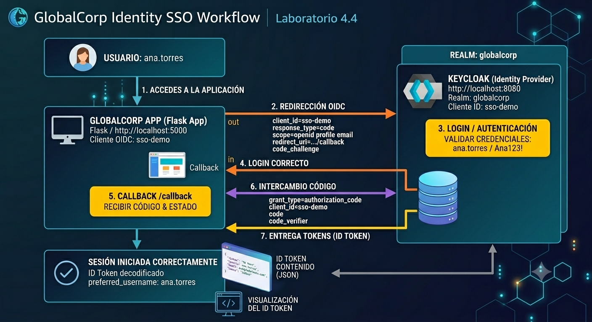

---

## Duración aproximada

**31 minutos**

---

## Tabla de ayuda

| Elemento | Descripción |
|---|---|
| Plataforma | Windows Server en máquina virtual de Azure |
| Terminal | Windows PowerShell |
| Proveedor de identidad | Keycloak |
| Protocolo usado | OpenID Connect |
| App cliente | Python + Flask |
| Puerto Keycloak | `8080` |
| Puerto app cliente | `5000` |
| Realm | `globalcorp` |
| Cliente OIDC | `sso-demo` |
| Usuario de prueba | `ana.torres` |
| Contraseña de prueba | `Ana123!` |

---

## Instrucciones

---

### Tarea 1. Comprender el escenario del laboratorio

En esta práctica trabajarás con una empresa ficticia llamada **GlobalCorp**.

GlobalCorp quiere habilitar inicio de sesión único para sus aplicaciones internas. Para ello usará Keycloak como proveedor de identidad y una aplicación cliente sencilla construida con Python y Flask.

| Componente | Función |
|---|---|
| Keycloak | Proveedor de identidad |
| Realm `globalcorp` | Espacio lógico donde se administran usuarios y clientes |
| Usuario `ana.torres` | Usuario que iniciará sesión |
| Cliente `sso-demo` | Aplicación registrada en Keycloak |
| Flask App | Aplicación cliente que redirige a Keycloak para autenticación |

#### ¿Sabías que…?

**OpenID Connect** es una capa de identidad construida sobre OAuth 2.0. OAuth 2.0 se enfoca en autorización; OpenID Connect agrega autenticación y permite que una aplicación conozca quién inició sesión.

---

### Tarea 2. Crear la estructura del laboratorio

Paso 1. Abrir **Windows PowerShell** como administrador.

Paso 2. Ejecutar:

```powershell
cd C:\

New-Item -ItemType Directory -Force -Path C:\labs | Out-Null
New-Item -ItemType Directory -Force -Path C:\labs\lab-04-keycloak-sso | Out-Null
New-Item -ItemType Directory -Force -Path C:\labs\lab-04-keycloak-sso\app | Out-Null
New-Item -ItemType Directory -Force -Path C:\labs\lab-04-keycloak-sso\keycloak | Out-Null

cd C:\labs\lab-04-keycloak-sso

dir
```

Resultado esperado:

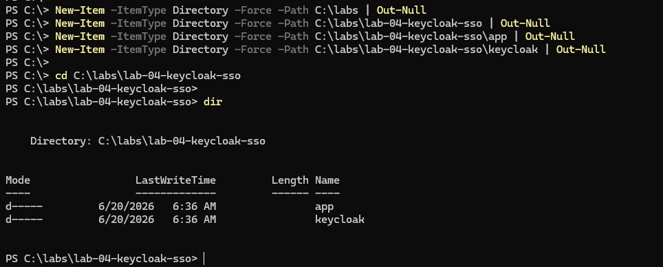

---

### Tarea 3. Instalar Java

Keycloak requiere Java para ejecutarse.

Paso 1. Buscar versiones disponibles:

```powershell
winget search temurin
```
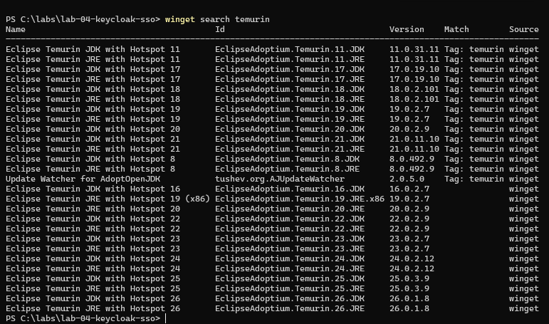
Paso 2. Instalar Java 21:

```powershell
winget install --id EclipseAdoptium.Temurin.21.JDK -e
```
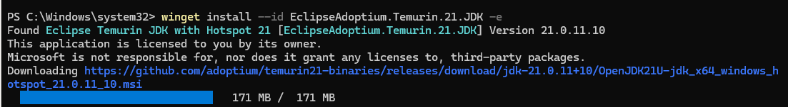
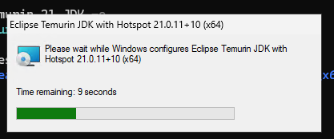

Si PowerShell solicita aceptar términos, escribir:

```text
Y
```

Paso 3. Cerrar PowerShell y abrir una nueva ventana.

Paso 4. Validar Java:

```powershell
java -version
```

Resultado esperado:

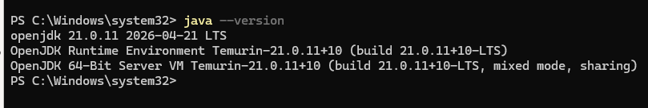

#### Solución si Java no aparece

```powershell
dir "C:\Program Files\Eclipse Adoptium"
```

Ubica la carpeta de Java. Por ejemplo:

```text
jdk-21.0.11.10-hotspot
```

Luego ejecuta:

```powershell
$env:Path = "C:\Program Files\Eclipse Adoptium\jdk-21.0.11.10-hotspot\bin;" + $env:Path
java -version
```

---

### Tarea 4. Descargar Keycloak

Paso 1. Ir a la carpeta de Keycloak:

```powershell
cd C:\labs\lab-04-keycloak-sso\keycloak
```

Paso 2. Definir variables:

```powershell
$KeycloakVersion = "26.6.3"
$KeycloakZip = "keycloak-$KeycloakVersion.zip"
$KeycloakUrl = "https://github.com/keycloak/keycloak/releases/download/$KeycloakVersion/$KeycloakZip"
```

Paso 3. Descargar Keycloak:

```powershell
Invoke-WebRequest -Uri $KeycloakUrl -OutFile $KeycloakZip
```

Durante la descarga puede aparecer en la parte superior:

```text
Writing request stream...
```

Esto es normal.

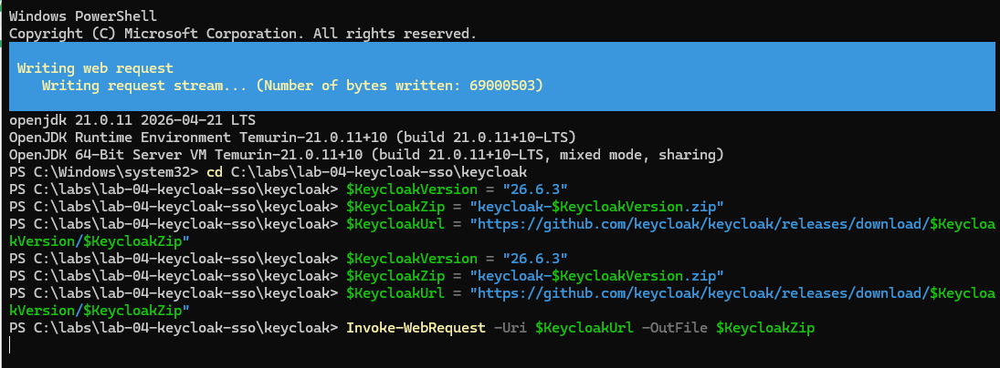

Paso 4. Descomprimir:

```powershell
Expand-Archive -Path .\keycloak-26.6.3.zip -DestinationPath . -Force
```
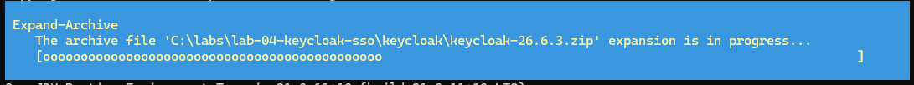
Paso 5. Validar:

```powershell
dir
```

Resultado esperado:

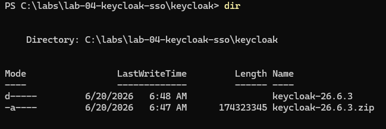


---

### Tarea 5. Iniciar Keycloak en modo desarrollo

Paso 1. Ir a la carpeta de Keycloak:

```powershell
cd C:\labs\lab-04-keycloak-sso\keycloak\keycloak-26.6.3
```

Paso 2. Crear el usuario administrador temporal:

```powershell
$env:KC_BOOTSTRAP_ADMIN_USERNAME="admin"
$env:KC_BOOTSTRAP_ADMIN_PASSWORD="Admin123!"
```

Paso 3. Iniciar Keycloak:

```powershell
.\bin\kc.bat start-dev
```

Resultado esperado:

```text
Keycloak started
```

O también:

```text
Listening on: http://0.0.0.0:8080
```

> Importante: deja esta ventana abierta. Si la cierras, Keycloak se detendrá.
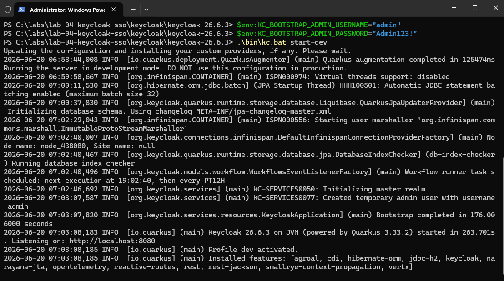

---

### Tarea 6. Entrar a la consola de administración de Keycloak

Paso 1. Abrir el navegador dentro de la VM.

Paso 2. Entrar a:

```text
http://localhost:8080
```

Paso 3. Entrar a:

```text
Administration Console
```

Paso 4. Iniciar sesión con:

```text
Usuario: admin
Contraseña: Admin123!
```

Resultado esperado:

```text
Keycloak Administration Console
```
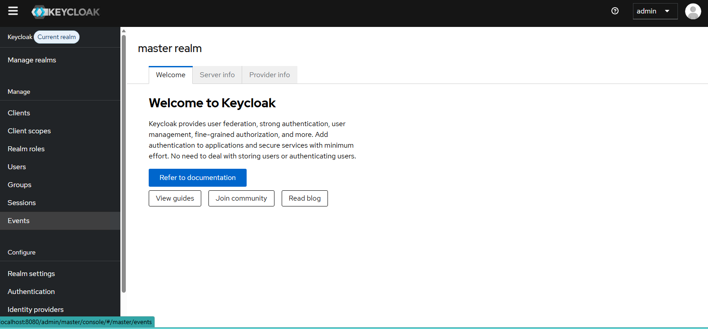

---

### Tarea 7. Crear el realm `globalcorp`

Paso 1. En el menú izquierdo, entrar a:

```text
Manage realms
```

Paso 2. Dar clic en:

```text
Create realm
```
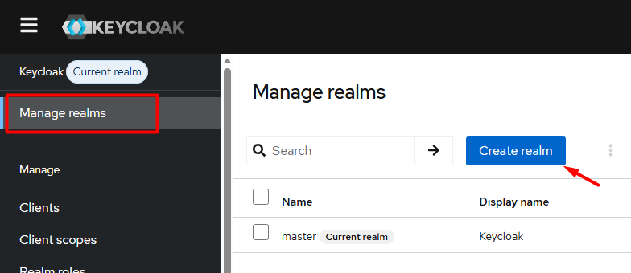
Paso 3. En **Realm name**, escribir:

```text
globalcorp
```

Paso 4. Dar clic en:

```text
Create
```
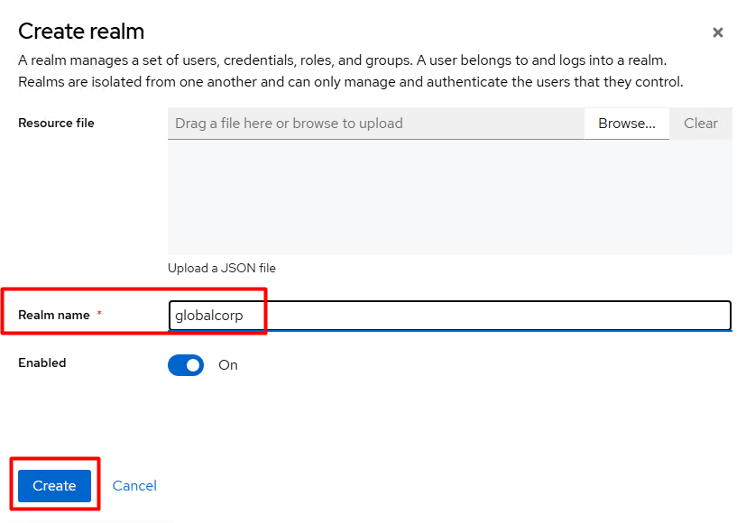
Resultado esperado:

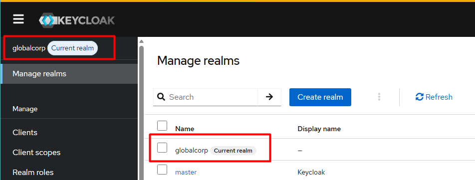

#### ¿Sabías que…?

Un **realm** es un espacio lógico dentro de Keycloak donde se administran usuarios, clientes, roles, sesiones y configuraciones.

---

### Tarea 8. Crear el usuario de prueba

Paso 1. En el menú izquierdo, dentro del realm `globalcorp`, entrar a:

```text
Users
```

Paso 2. Dar clic en:

```text
Create new user
```

Paso 3. Completar:

```text
Username: ana.torres
Email: ana@globalcorp.com
First name: Ana
Last name: Torres
Email verified: On
Enabled: On
```

Paso 4. Dar clic en:

```text
Create
```
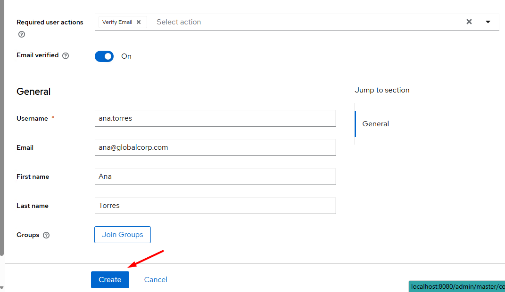

Paso 5. Entrar a la pestaña:

```text
Credentials
```

Paso 6. Dar clic en:

```text
Set password
```
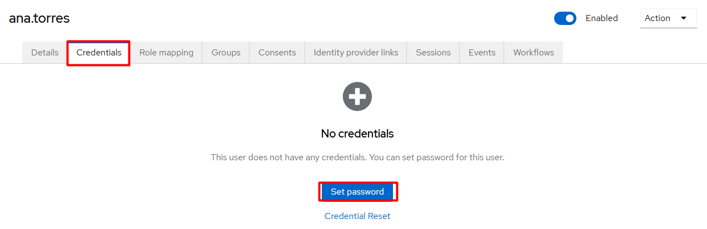
Paso 7. Configurar:

```text
Password: Ana123!
Password confirmation: Ana123!
Temporary: Off
```

Paso 8. Guardar la contraseña.

Resultado esperado:

```text
Usuario: ana.torres
Email: ana@globalcorp.com
Contraseña: Ana123!
Temporary: Off
```

> No selecciones `Update Password` en Required user actions para esta práctica.

---

### Tarea 9. Crear el cliente OIDC `sso-demo`

Paso 1. En el menú izquierdo, entrar a:

```text
Clients
```

Paso 2. Dar clic en:

```text
Create client
```

Paso 3. Configurar datos básicos:

```text
Client type: OpenID Connect
Client ID: sso-demo
Name: SSO Demo App
```

Paso 4. Dar clic en **Next**.

Paso 5. Configurar capacidades:

```text
Client authentication: Off
Authorization: Off
Standard flow: On
Direct access grants: On
Implicit flow: Off
Service accounts roles: Off
```

Paso 6. Dar clic en **Next**.

Paso 7. Configurar URLs:

```text
Root URL: http://localhost:5000
Home URL: http://localhost:5000
Valid redirect URIs: http://localhost:5000/*
Valid post logout redirect URIs: http://localhost:5000/*
Web origins: http://localhost:5000
```

Paso 8. Dar clic en **Save**.

Resultado esperado:

```text
Client ID: sso-demo
Protocol: OpenID Connect
Standard flow: On
Client authentication: Off
```

#### ¿Sabías que…?

Un **client** en Keycloak representa una aplicación que solicita autenticación.

---

### Tarea 10. Crear la aplicación cliente en Python

> Importante: deja abierta la ventana donde Keycloak está corriendo.

Abre una **nueva ventana de PowerShell** para la aplicación.

Paso 1. Ir a la carpeta de la app:

```powershell
cd C:\labs\lab-04-keycloak-sso\app
```

Paso 2. Crear entorno virtual:

```powershell
python -m venv venv
```

Paso 3. Activar el entorno virtual:

```powershell
.\venv\Scripts\Activate.ps1
```

Resultado esperado:

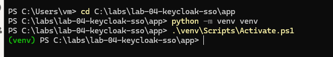


Paso 4. Instalar librerías:

```powershell
pip install flask requests
```

Paso 5. Crear el archivo `app.py`:

```powershell
@'
from flask import Flask, redirect, request, session, url_for
import requests
import secrets
import hashlib
import base64
import json

app = Flask("globalcorp_app")
app.secret_key = "laboratorio-keycloak-sso"

KEYCLOAK_BASE_URL = "http://localhost:8080"
REALM = "globalcorp"
CLIENT_ID = "sso-demo"
REDIRECT_URI = "http://localhost:5000/callback"

AUTH_URL = f"{KEYCLOAK_BASE_URL}/realms/{REALM}/protocol/openid-connect/auth"
TOKEN_URL = f"{KEYCLOAK_BASE_URL}/realms/{REALM}/protocol/openid-connect/token"
LOGOUT_URL = f"{KEYCLOAK_BASE_URL}/realms/{REALM}/protocol/openid-connect/logout"


def create_code_verifier():
    return base64.urlsafe_b64encode(secrets.token_bytes(40)).decode("utf-8").rstrip("=")


def create_code_challenge(verifier):
    digest = hashlib.sha256(verifier.encode("utf-8")).digest()
    return base64.urlsafe_b64encode(digest).decode("utf-8").rstrip("=")


def decode_jwt_without_validation(token):
    try:
        payload = token.split(".")[1]
        payload += "=" * (-len(payload) % 4)
        decoded = base64.urlsafe_b64decode(payload)
        return json.loads(decoded)
    except Exception:
        return {"error": "No se pudo decodificar el token"}


@app.route("/")
def home():
    user = session.get("user")

    if user:
        return f"""
        <html>
            <head>
                <title>GlobalCorp App</title>
                <style>
                    body {{ font-family: Arial, sans-serif; margin: 40px; background: #f4f6f8; }}
                    .card {{ background: white; padding: 24px; border-radius: 10px; max-width: 760px; box-shadow: 0 2px 8px rgba(0,0,0,0.1); }}
                    pre {{ background: #f1f1f1; padding: 16px; border-radius: 8px; overflow-x: auto; }}
                    a.button {{ display: inline-block; margin-top: 16px; padding: 10px 16px; background: #a73200; color: white; text-decoration: none; border-radius: 6px; }}
                </style>
            </head>
            <body>
                <div class="card">
                    <h1>GlobalCorp App</h1>
                    <h2>Sesión iniciada correctamente</h2>
                    <p><strong>Usuario:</strong> {user.get("preferred_username")}</p>
                    <p><strong>Nombre:</strong> {user.get("name")}</p>
                    <p><strong>Email:</strong> {user.get("email")}</p>
                    <h3>Contenido del ID Token</h3>
                    <pre>{json.dumps(user, indent=2, ensure_ascii=False)}</pre>
                    <a class="button" href="/logout">Cerrar sesión</a>
                </div>
            </body>
        </html>
        """

    return """
    <html>
        <head>
            <title>GlobalCorp App</title>
            <style>
                body { font-family: Arial, sans-serif; margin: 40px; background: #f4f6f8; }
                .card { background: white; padding: 24px; border-radius: 10px; max-width: 640px; box-shadow: 0 2px 8px rgba(0,0,0,0.1); }
                a.button { display: inline-block; margin-top: 16px; padding: 10px 16px; background: #035b6e; color: white; text-decoration: none; border-radius: 6px; }
            </style>
        </head>
        <body>
            <div class="card">
                <h1>GlobalCorp App</h1>
                <p>Aplicación cliente para probar SSO con Keycloak y OpenID Connect.</p>
                <a class="button" href="/login">Iniciar sesión con Keycloak</a>
            </div>
        </body>
    </html>
    """


@app.route("/login")
def login():
    state = secrets.token_urlsafe(16)
    nonce = secrets.token_urlsafe(16)
    code_verifier = create_code_verifier()
    code_challenge = create_code_challenge(code_verifier)

    session["state"] = state
    session["nonce"] = nonce
    session["code_verifier"] = code_verifier

    auth_request_url = (
        f"{AUTH_URL}"
        f"?client_id={CLIENT_ID}"
        f"&response_type=code"
        f"&scope=openid profile email"
        f"&redirect_uri={REDIRECT_URI}"
        f"&state={state}"
        f"&nonce={nonce}"
        f"&code_challenge={code_challenge}"
        f"&code_challenge_method=S256"
    )

    return redirect(auth_request_url)


@app.route("/callback")
def callback():
    error = request.args.get("error")
    if error:
        return f"Error recibido desde Keycloak: {error}", 400

    code = request.args.get("code")
    state = request.args.get("state")

    if state != session.get("state"):
        return "Error: el parámetro state no coincide.", 400

    token_request_data = {
        "grant_type": "authorization_code",
        "client_id": CLIENT_ID,
        "code": code,
        "redirect_uri": REDIRECT_URI,
        "code_verifier": session.get("code_verifier")
    }

    token_response = requests.post(TOKEN_URL, data=token_request_data)

    if token_response.status_code != 200:
        return f"""
        <h1>Error al solicitar tokens</h1>
        <p>Status code: {token_response.status_code}</p>
        <pre>{token_response.text}</pre>
        """, 400

    tokens = token_response.json()
    id_token = tokens.get("id_token")
    user_info = decode_jwt_without_validation(id_token)

    session["tokens"] = tokens
    session["user"] = user_info

    return redirect(url_for("home"))


@app.route("/logout")
def logout():
    session.clear()

    logout_redirect = (
        f"{LOGOUT_URL}"
        f"?client_id={CLIENT_ID}"
        f"&post_logout_redirect_uri=http://localhost:5000/"
    )

    return redirect(logout_redirect)


app.run(host="localhost", port=5000, debug=True)
'@ | Set-Content -Path .\app.py -Encoding UTF8
```

Paso 6. Validar que el archivo existe:

```powershell
dir .\app.py
```

---

### Tarea 11. Ejecutar la aplicación cliente

En la ventana de PowerShell de la app, ejecutar:

```powershell
python .\app.py
```

Resultado esperado:

```text
Running on http://localhost:5000
```

> Importante: deja esta ventana abierta. Si la cierras, la aplicación se detendrá.
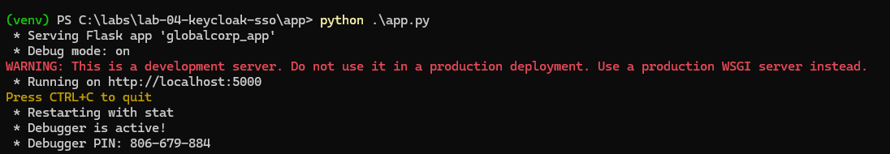

---

### Tarea 12. Probar el inicio de sesión SSO

Paso 1. Abrir el navegador dentro de la VM.

Paso 2. Entrar a:

```text
http://localhost:5000
```

Paso 3. Dar clic en:

```text
Iniciar sesión con Keycloak
```

Paso 4. Keycloak debe mostrar una pantalla de login con el título:

```text
GLOBALCORP
```

Paso 5. Iniciar sesión con:

```text
Username or email: ana.torres
Password: Ana123!
```

Paso 6. Dar clic en **Sign In**.

Resultado esperado:

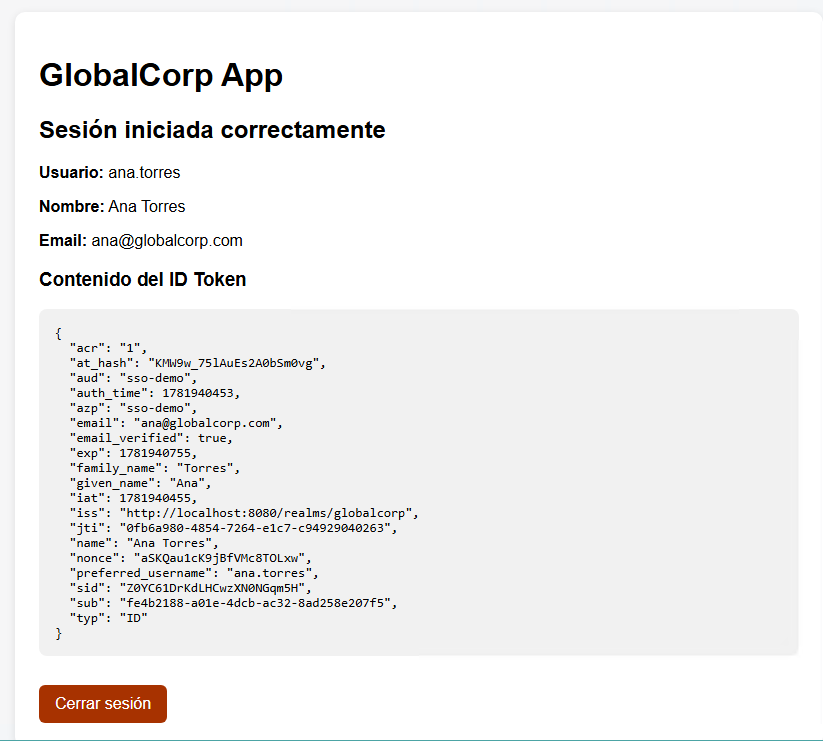


También debe mostrarse el contenido del **ID Token**.

---

### Tarea 13. Analizar el ID Token

Después del inicio de sesión, la app mostrará información similar a:

```json
{
  "iss": "http://localhost:8080/realms/globalcorp",
  "aud": "sso-demo",
  "sub": "identificador-unico-del-usuario",
  "typ": "ID",
  "preferred_username": "ana.torres",
  "email": "ana@globalcorp.com",
  "name": "Ana Torres"
}
```

Campos importantes:

| Campo | Significado |
|---|---|
| `iss` | Emisor del token |
| `aud` | Cliente para el que fue emitido el token |
| `sub` | Identificador único del usuario |
| `typ` | Tipo de token |
| `preferred_username` | Nombre de usuario |
| `email` | Correo del usuario |
| `name` | Nombre del usuario |

---

### Tarea 14. Probar cierre de sesión

En la app, dar clic en:

```text
Cerrar sesión
```

Resultado esperado:

- La sesión local de Flask se limpia.
- El usuario sale del flujo autenticado.
- La app puede volver a mostrar la pantalla inicial.

---

### Tarea 15. Validar evidencias del laboratorio

Al finalizar, debes contar con las siguientes evidencias:

```text
1. Keycloak ejecutándose en localhost:8080
2. Realm globalcorp creado
3. Usuario ana.torres creado
4. Cliente OIDC sso-demo configurado
5. App Flask ejecutándose en localhost:5000
6. Login exitoso con Keycloak
7. Visualización del ID Token en la app
8. Prueba de cierre de sesión
```

---

## Solución de problemas

### Error: `localhost refused to connect` al entrar a `localhost:8080`

Causa probable: Keycloak no está corriendo.

Solución:

```powershell
cd C:\labs\lab-04-keycloak-sso\keycloak\keycloak-26.6.3

$env:KC_BOOTSTRAP_ADMIN_USERNAME="admin"
$env:KC_BOOTSTRAP_ADMIN_PASSWORD="Admin123!"

.\bin\kc.bat start-dev
```

---

### Error: `localhost refused to connect` al entrar a `localhost:5000`

Causa probable: la app Flask no está corriendo.

Solución:

```powershell
cd C:\labs\lab-04-keycloak-sso\app
.\venv\Scripts\Activate.ps1
python .\app.py
```

---

### Error: `No module named 'flask'`

Causa probable: no está activo el entorno virtual o no se instalaron las librerías.

Solución:

```powershell
cd C:\labs\lab-04-keycloak-sso\app
.\venv\Scripts\Activate.ps1
pip install flask requests
python .\app.py
```

---

### Error: `Client not found`

Causa probable: el cliente configurado en Keycloak no coincide con el `CLIENT_ID` de la app.

Solución recomendada:

Validar que en Keycloak exista el cliente:

```text
sso-demo
```

Y que en `app.py` exista:

```python
CLIENT_ID = "sso-demo"
```

Validar también:

```text
Valid redirect URIs: http://localhost:5000/*
Web origins: http://localhost:5000
```

---

### Error con `__name__`

Causa probable: al copiar y pegar, algunos editores o formatos modifican los dobles guiones bajos.

Solución:

Este laboratorio usa:

```python
app = Flask("globalcorp_app")
```

Y al final:

```python
app.run(host="localhost", port=5000, debug=True)
```

Así se evita depender de:

```python
if __name__ == "__main__":
```

---

## Actividad de cierre

Responde las siguientes preguntas:

1. ¿Qué función cumple Keycloak en este laboratorio?
2. ¿Qué es un realm?
3. ¿Qué representa el cliente `sso-demo`?
4. ¿Qué protocolo se usó para el inicio de sesión?
5. ¿Qué puerto usa Keycloak?
6. ¿Qué puerto usa la app Flask?
7. ¿Qué significa `redirect_uri`?
8. ¿Qué información muestra el ID Token?
9. ¿Qué scopes se solicitaron?
10. ¿Qué diferencia hay entre OAuth 2.0 y OpenID Connect?

---

## Respuestas esperadas

1. Keycloak funciona como proveedor de identidad.
2. Un realm es un espacio lógico donde se administran usuarios, clientes y configuraciones.
3. Representa la aplicación cliente registrada en Keycloak.
4. OpenID Connect.
5. Keycloak usa el puerto `8080`.
6. La app Flask usa el puerto `5000`.
7. Es la URL a la que Keycloak devuelve al usuario después de autenticarse.
8. Muestra datos como emisor, audiencia, usuario, correo, nombre e identificador único.
9. `openid profile email`.
10. OAuth 2.0 se enfoca en autorización; OpenID Connect agrega autenticación e identidad.

---

## Conclusiones

En este laboratorio se configuró un flujo básico de SSO usando Keycloak y una aplicación cliente.

### Puntos clave aprendidos

- Keycloak puede actuar como proveedor de identidad para aplicaciones.
- Un realm permite separar configuraciones, usuarios y clientes.
- Una aplicación debe registrarse como client para usar OIDC.
- La Redirect URI controla a dónde puede regresar el usuario después del login.
- OpenID Connect permite autenticar usuarios usando flujos basados en OAuth 2.0.
- El ID Token contiene información de identidad del usuario autenticado.
- Los scopes determinan qué información solicita la aplicación.
- Para que el laboratorio funcione, deben estar activos dos servicios: Keycloak en `localhost:8080` y Flask en `localhost:5000`.
- El cierre de sesión forma parte del ciclo completo de autenticación.

Este laboratorio demuestra cómo una aplicación puede delegar la autenticación a un proveedor de identidad moderno y recibir información confiable sobre el usuario autenticado.

### Fin del laboratorio 4.4
