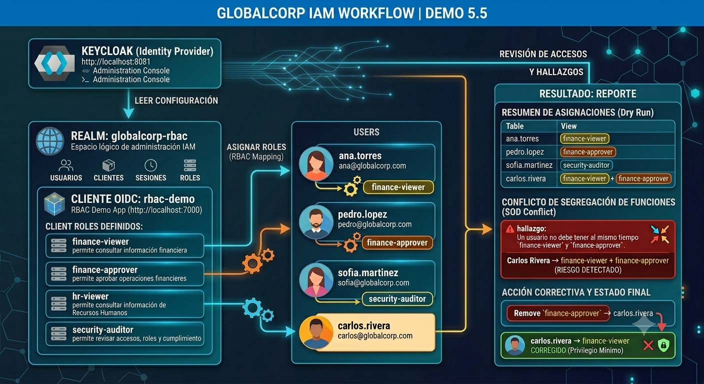
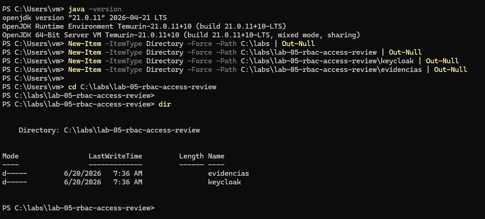
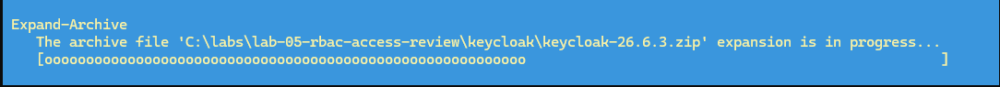
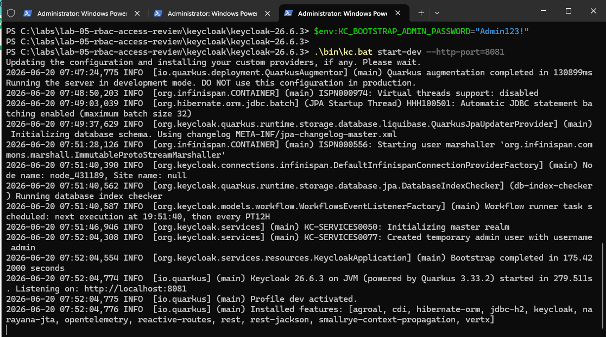
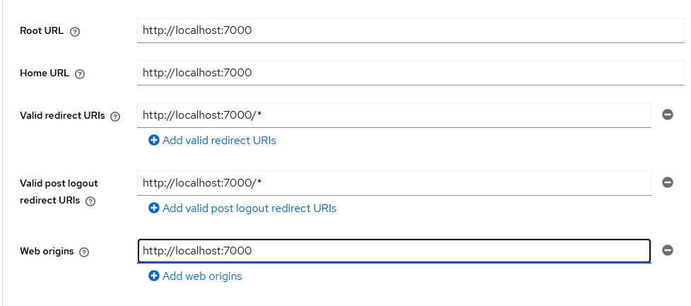
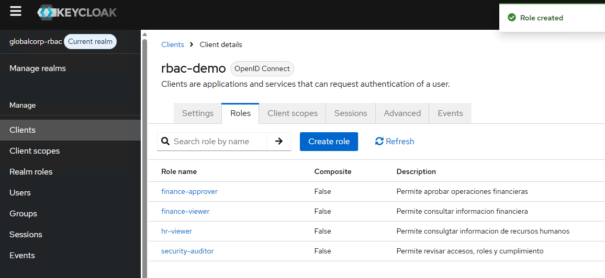
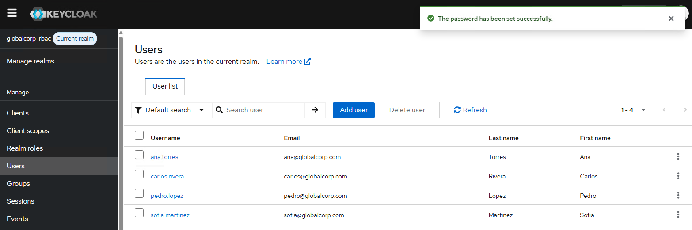

# Demostración 5.5: Asignación de roles y revisión de accesos en Keycloak

## Objetivo de la demostración

Al finalizar la demostración, serás capaz de:

- Comprender cómo se aplica RBAC en una herramienta IAM.
- Crear roles funcionales dentro de una aplicación cliente.
- Crear usuarios de prueba con perfiles diferentes.
- Asignar roles a usuarios.
- Revisar accesos asignados.
- Identificar un conflicto de segregación de funciones.
- Proponer una acción correctiva basada en privilegio mínimo.
- Relacionar RBAC con cumplimiento, auditoría y revisión periódica de accesos.

---

## Objetivo visual



---

## Duración aproximada

**25 minutos**

---

## Tabla de ayuda

| Elemento | Descripción |
|---|---|
| Plataforma | Windows Server en máquina virtual de Azure |
| Terminal | Windows PowerShell |
| Herramienta IAM | Keycloak |
| Puerto usado | `8081` |
| Realm | `globalcorp-rbac` |
| Cliente | `rbac-demo` |
| Modelo principal | RBAC |
| Conceptos relacionados | ABAC, privilegio mínimo, segregación de funciones, revisión de accesos |
| Tipo de actividad | Demostración guiada |

---

## Aviso importante para el participante

Esta demostración es independiente de prácticas anteriores.

Si **no completaste una práctica anterior de Keycloak**, debes ejecutar desde la **Tarea 1** para preparar el entorno, instalar Java si hace falta, descargar Keycloak e iniciar el servidor.

Si **ya completaste una práctica anterior de Keycloak en esta misma máquina** y Java ya está instalado, puedes saltar la instalación de Java y comenzar validando:

```powershell
java -version
```

Si `java -version` responde correctamente, continúa con la descarga o ejecución de Keycloak para esta demostración.

---

## Instrucciones

---

### Tarea 1. Crear la carpeta de la demostración

Paso 1. Abrir **Windows PowerShell como administrador**.

Paso 2. Ejecutar:

```powershell
cd C:\

New-Item -ItemType Directory -Force -Path C:\labs | Out-Null
New-Item -ItemType Directory -Force -Path C:\labs\lab-05-rbac-access-review | Out-Null
New-Item -ItemType Directory -Force -Path C:\labs\lab-05-rbac-access-review\keycloak | Out-Null
New-Item -ItemType Directory -Force -Path C:\labs\lab-05-rbac-access-review\evidencias | Out-Null

cd C:\labs\lab-05-rbac-access-review

dir
```

Resultado esperado:



---

### Tarea 2. Validar o instalar Java

Paso 1. Validar si Java ya está instalado:

```powershell
java -version
```

Resultado esperado si Java ya existe:

```text
openjdk version "21..."
```

Si este comando funciona, puedes continuar con la **Tarea 3**.

Si aparece un error como:

```text
java : The term 'java' is not recognized
```

debes instalar Java.

#### Instalación de Java

Paso 1. Buscar Eclipse Temurin:

```powershell
winget search temurin
```

Paso 2. Instalar Java 21:

```powershell
winget install --id EclipseAdoptium.Temurin.21.JDK -e
```

Si solicita aceptar términos, escribir:

```text
Y
```

Paso 3. Cerrar PowerShell completamente y abrir una nueva ventana como administrador.

Paso 4. Validar Java:

```powershell
java -version
```

Resultado esperado:

```text
openjdk version "21..."
```

#### Solución si Java no aparece después de instalar

```powershell
dir "C:\Program Files\Eclipse Adoptium"
```

Identificar la carpeta del JDK. Ejemplo:

```text
jdk-21.0.11.10-hotspot
```

Después ejecutar, ajustando el nombre de la carpeta si es diferente:

```powershell
$env:Path = "C:\Program Files\Eclipse Adoptium\jdk-21.0.11.10-hotspot\bin;" + $env:Path
java -version
```

---

### Tarea 3. Descargar Keycloak

Paso 1. Ir a la carpeta:

```powershell
cd C:\labs\lab-05-rbac-access-review\keycloak
```

Paso 2. Descargar y descomprimir Keycloak:

```powershell
$KeycloakVersion = "26.6.3"
$KeycloakZip = "keycloak-$KeycloakVersion.zip"
$KeycloakUrl = "https://github.com/keycloak/keycloak/releases/download/$KeycloakVersion/$KeycloakZip"

Invoke-WebRequest -Uri $KeycloakUrl -OutFile $KeycloakZip

Expand-Archive -Path $KeycloakZip -DestinationPath . -Force

dir
```

Resultado esperado:




---

### Tarea 4. Iniciar Keycloak en el puerto 8081

En esta demostración se usa el puerto `8081` para evitar conflictos con laboratorios anteriores.

```powershell
cd C:\labs\lab-05-rbac-access-review\keycloak\keycloak-26.6.3

$env:KC_BOOTSTRAP_ADMIN_USERNAME="admin"
$env:KC_BOOTSTRAP_ADMIN_PASSWORD="Admin123!"

.\bin\kc.bat start-dev --http-port=8081
```

Resultado esperado:

```text
Keycloak started
```

O también:

```text
Listening on: http://0.0.0.0:8081
```

> Importante: deja esta ventana abierta. Si se cierra, Keycloak se detendrá.


---

### Tarea 5. Entrar a la consola de administración

Paso 1. Abrir el navegador dentro de la VM.

Paso 2. Entrar a:

```text
http://localhost:8081
```

Paso 3. Abrir:

```text
Administration Console
```

Paso 4. Iniciar sesión con:

```text
Usuario: admin
Contraseña: Admin123!
```

Resultado esperado:

```text
Keycloak Administration Console
```

---

### Tarea 6. Crear el realm `globalcorp-rbac`

Paso 1. En el menú izquierdo, entrar a:

```text
Manage realms
```

Paso 2. Dar clic en:

```text
Create realm
```

Paso 3. En **Realm name**, escribir:

```text
globalcorp-rbac
```

Paso 4. Dar clic en:

```text
Create
```

Resultado esperado:

```text
globalcorp-rbac
Current realm
```

#### ¿Sabías que…?
**Concepto: Realm**

Un realm es un espacio lógico de administración. Permite tener usuarios, clientes, roles y sesiones separados de otros entornos.

---

### Tarea 7. Crear el cliente `rbac-demo`

Este cliente representa la aplicación sobre la cual se asignarán roles.

Paso 1. Dentro del realm `globalcorp-rbac`, ir a:

```text
Clients
```

Paso 2. Dar clic en:

```text
Create client
```

Paso 3. Completar:

```text
Client type: OpenID Connect
Client ID: rbac-demo
Name: RBAC Demo App
Description: Aplicación de demostración para asignación de roles y revisión de accesos
```

Paso 4. Dar clic en **Next**.

Paso 5. Configurar capacidades:

```text
Client authentication: Off
Authorization: Off
Standard flow: On
Direct access grants: On
Implicit flow: Off
Service accounts roles: Off
```

Paso 6. Dar clic en **Next**.

Paso 7. Configurar URLs locales simuladas:

```text
Root URL: http://localhost:7000
Home URL: http://localhost:7000
Valid redirect URIs: http://localhost:7000/*
Valid post logout redirect URIs: http://localhost:7000/*
Web origins: http://localhost:7000
```


Paso 8. Dar clic en **Save**.

Resultado esperado:

```text
Client ID: rbac-demo
Protocol: OpenID Connect
```

---

### Tarea 8. Crear roles RBAC dentro del cliente

Paso 1. Entrar a:

```text
Clients > rbac-demo > Roles
```

Paso 2. Crear estos roles:

```text
Role name: finance-viewer
Description: Permite consultar información financiera.
```

```text
Role name: finance-approver
Description: Permite aprobar operaciones financieras.
```

```text
Role name: hr-viewer
Description: Permite consultar información de Recursos Humanos.
```

```text
Role name: security-auditor
Description: Permite revisar accesos, roles y cumplimiento.
```

Resultado esperado:




#### ¿Sabías que…?
**Concepto: RBAC**

RBAC significa Role-Based Access Control. En este modelo, los permisos no se asignan directamente a cada persona, sino a roles. Después, los usuarios reciben roles según su función.

---

### Tarea 9. Crear usuarios para la demostración

Crear los siguientes usuarios desde:

```text
Users > Create new user
```

#### Usuario 1: Ana Torres

```text
Username: ana.torres
Email: ana@globalcorp.com
First name: Ana
Last name: Torres
Email verified: On
Enabled: On
```

En **Credentials**, configurar:

```text
Password: Ana123!
Password confirmation: Ana123!
Temporary: Off
```

#### Usuario 2: Pedro López

```text
Username: pedro.lopez
Email: pedro@globalcorp.com
First name: Pedro
Last name: Lopez
Email verified: On
Enabled: On
```

En **Credentials**, configurar:

```text
Password: Pedro123!
Password confirmation: Pedro123!
Temporary: Off
```

#### Usuario 3: Sofía Martínez

```text
Username: sofia.martinez
Email: sofia@globalcorp.com
First name: Sofia
Last name: Martinez
Email verified: On
Enabled: On
```

En **Credentials**, configurar:

```text
Password: Sofia123!
Password confirmation: Sofia123!
Temporary: Off
```

#### Usuario 4: Carlos Rivera

```text
Username: carlos.rivera
Email: carlos@globalcorp.com
First name: Carlos
Last name: Rivera
Email verified: On
Enabled: On
```

En **Credentials**, configurar:

```text
Password: Carlos123!
Password confirmation: Carlos123!
Temporary: Off
```

Resultado esperado:



---

### Tarea 10. Asignar roles RBAC

Asignar los siguientes roles desde:

```text
Users > usuario > Role mapping > Assign role > Filter by clients
```

| Usuario | Rol asignado |
|---|---|
| `ana.torres` | `finance-viewer` |
| `pedro.lopez` | `finance-approver` |
| `sofia.martinez` | `security-auditor` |
| `carlos.rivera` | `finance-viewer` + `finance-approver` |

#### Asignar rol a Ana Torres

```text
Users > ana.torres > Role mapping > Assign role > Client roles> finance-viewer > Assign
```

Resultado esperado:

```text
ana.torres -> finance-viewer
```

#### Asignar rol a Pedro López

```text
Users > pedro.lopez > Role mapping > Assign role > Client roles > finance-approver > Assign
```

Resultado esperado:

```text
pedro.lopez -> finance-approver
```

#### Asignar rol a Sofía Martínez

```text
Users > sofia.martinez > Role mapping > Assign role > Client roles > security-auditor > Assign
```

Resultado esperado:

```text
sofia.martinez -> security-auditor
```

#### Asignar roles a Carlos Rivera

```text
Users > carlos.rivera > Role mapping > Assign role > Client roles
```

Seleccionar:

```text
finance-viewer
finance-approver
```

Resultado esperado:

```text
carlos.rivera -> finance-viewer + finance-approver
```

#### ¿Sabías que…?
**Concepto: Privilegio mínimo**

El privilegio mínimo consiste en asignar solo los accesos necesarios para cumplir una función.

---

### Tarea 11. Revisar accesos asignados

Validar los roles asignados desde:

```text
Users > usuario > Role mapping
```

| Usuario | Roles esperados | Interpretación |
|---|---|---|
| `ana.torres` | `finance-viewer` | Puede consultar información financiera |
| `pedro.lopez` | `finance-approver` | Puede aprobar operaciones financieras |
| `sofia.martinez` | `security-auditor` | Puede revisar accesos y cumplimiento |
| `carlos.rivera` | `finance-viewer`, `finance-approver` | Tiene un posible conflicto |

---

### Tarea 12. Detectar conflicto de segregación de funciones

Regla de control:

```text
Un usuario no debe tener al mismo tiempo finance-viewer y finance-approver.
```

Usuario con conflicto:

```text
carlos.rivera
```

Roles conflictivos:

```text
finance-viewer
finance-approver
```

Interpretación:

Carlos puede consultar información financiera y también aprobar operaciones financieras. Esto representa un riesgo porque una misma persona podría participar en dos etapas que deberían estar separadas.

#### ¿Sabías que…?
**Concepto: Segregación de funciones**

La segregación de funciones busca evitar que una sola persona concentre actividades incompatibles.

Ejemplo:

```text
Consultar o preparar información financiera
+
Aprobar operaciones financieras
```

Esta combinación puede incrementar riesgos de fraude, error o abuso de privilegios.

---

### Tarea 13. Aplicar acción correctiva

Para corregir el conflicto, se recomienda remover a Carlos el rol:

```text
finance-approver
```

Pasos:

```text
Users > carlos.rivera > Role mapping
```

Ubicar:

```text
finance-approver
```

Seleccionarlo y dar clic en:

```text
Unassign
```

o:

```text
Remove
```

según la versión de Keycloak.

Resultado esperado después de corregir:

```text
carlos.rivera -> finance-viewer
```

Interpretación:

Carlos conserva acceso de consulta, pero ya no puede aprobar operaciones financieras.

---

### Tarea 14. Validar evidencias finales

Al finalizar, debes contar con las siguientes evidencias:

```text
1. Keycloak iniciado en localhost:8081
2. Realm globalcorp-rbac creado
3. Cliente rbac-demo creado
4. Roles RBAC creados
5. Usuarios creados
6. Roles asignados
7. Revisión de accesos realizada
8. Conflicto de segregación de funciones identificado
9. Acción correctiva aplicada
```

---

## Solución de problemas

### Error: `java is not recognized`

Causa probable: Java no está instalado o el PATH no se actualizó.

Solución:

```powershell
winget install --id EclipseAdoptium.Temurin.21.JDK -e
```

Cerrar y abrir PowerShell nuevamente. Luego validar:

```powershell
java -version
```

---

### Error: no abre `http://localhost:8081`

Causa probable: Keycloak no está corriendo o la ventana de PowerShell fue cerrada.

Solución:

```powershell
cd C:\labs\lab-05-rbac-access-review\keycloak\keycloak-26.6.3

$env:KC_BOOTSTRAP_ADMIN_USERNAME="admin"
$env:KC_BOOTSTRAP_ADMIN_PASSWORD="Admin123!"

.\bin\kc.bat start-dev --http-port=8081
```

---

### No aparece el rol al asignarlo

Causa probable: el filtro está mostrando roles de realm, no roles de cliente.

Solución:

```text
Filter by clients
```

Luego buscar el rol correspondiente.

---

## Actividad de cierre

Responde las siguientes preguntas:

1. ¿Qué modelo de control de acceso se demostró?
2. ¿Qué representa el cliente `rbac-demo`?
3. ¿Qué rol permite consultar información financiera?
4. ¿Qué rol permite aprobar operaciones financieras?
5. ¿Qué usuario representa el perfil auditor?
6. ¿Qué usuario tenía conflicto de segregación de funciones?
7. ¿Qué combinación de roles generó el conflicto?
8. ¿Qué acción correctiva se aplicó?
9. ¿Qué principio se refuerza al remover un rol innecesario?
10. ¿Por qué es importante revisar accesos periódicamente?

---

## Respuestas esperadas

1. RBAC.
2. Una aplicación ficticia donde se controlan accesos por roles.
3. `finance-viewer`.
4. `finance-approver`.
5. `sofia.martinez`.
6. `carlos.rivera`.
7. `finance-viewer` + `finance-approver`.
8. Remover el rol `finance-approver` de Carlos.
9. Privilegio mínimo.
10. Porque permite detectar accesos innecesarios, excesivos o incompatibles antes de que generen riesgos.

---

## Conclusiones

En esta demostración se configuró un modelo RBAC básico en Keycloak y se realizó una revisión de accesos.

### Puntos clave aprendidos

- RBAC permite controlar accesos mediante roles.
- Los roles deben diseñarse de acuerdo con funciones reales de negocio.
- El privilegio mínimo reduce exposición a riesgos.
- La segregación de funciones evita combinaciones de acceso incompatibles.
- Las revisiones periódicas ayudan a detectar permisos excesivos.
- Un usuario puede tener múltiples roles, pero no todas las combinaciones son seguras.
- Keycloak permite crear clientes, roles y asignaciones de acceso.
- La revisión de accesos es una actividad clave para cumplimiento.

Esta demostración muestra que el control de acceso no termina al asignar roles. También es necesario revisar, detectar conflictos y corregir permisos para mantener un modelo seguro y gobernable.

### Fin de la demostración 5.5
