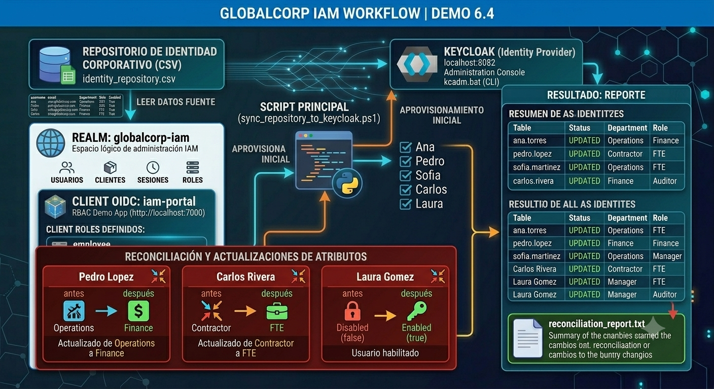
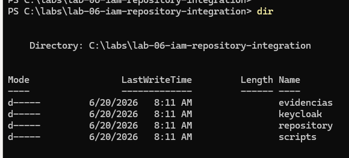
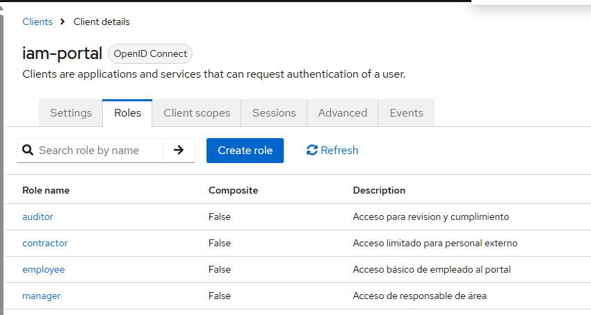
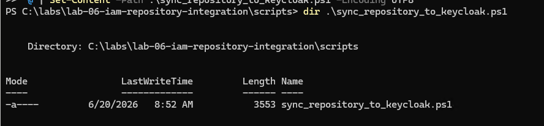
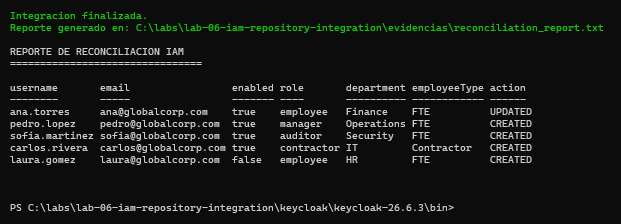
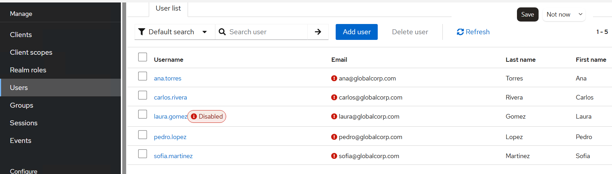
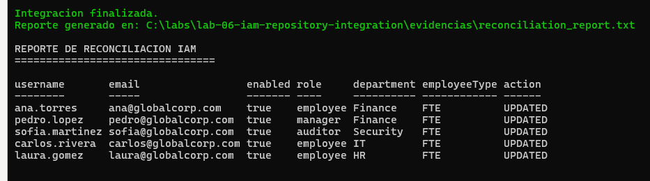

# Demostración 6.4: Integración de una herramienta IAM con un repositorio de identidad

## Objetivo de la demostración

Al finalizar la demostración, serás capaz de:

- Comprender cómo una herramienta IAM puede integrarse con un repositorio de identidad.
- Usar Keycloak como plataforma IAM demostrativa.
- Simular un repositorio de identidad con un archivo CSV.
- Aprovisionar usuarios en Keycloak desde un repositorio externo.
- Actualizar atributos básicos de usuarios.
- Deshabilitar y habilitar usuarios según la fuente de identidad.
- Ejecutar una reconciliación básica entre el repositorio fuente y Keycloak.
- Generar evidencias de aprovisionamiento, reconciliación y control operativo.

---

## Objetivo visual



Resultado:
- Usuarios creados
- Usuarios actualizados
- Usuarios deshabilitados/habilitados
- Roles asignados
- Reporte de reconciliación
```

---

## Duración aproximada

**31 minutos**

---

## Tabla de ayuda

| Elemento | Descripción |
|---|---|
| Plataforma | Windows Server en máquina virtual de Azure |
| Terminal | Windows PowerShell |
| Herramienta IAM | Keycloak |
| Repositorio de identidad | Archivo CSV |
| Puerto Keycloak | `8082` |
| Realm | `globalcorp-iam` |
| Cliente | `iam-portal` |
| Script principal | `sync_repository_to_keycloak.ps1` |
| Comando de administración | `kcadm.bat` |
| Tipo de práctica | Integración IAM, aprovisionamiento y reconciliación |

---

## Aviso importante para el participante

Esta demostración es independiente de prácticas anteriores.

Si **no completaste prácticas anteriores con Keycloak**, debes ejecutar desde la **Tarea 1** para preparar el entorno, validar o instalar Java, descargar Keycloak e iniciar el servidor.

Si **ya completaste una práctica anterior de Keycloak en esta misma máquina** y Java ya está instalado, puedes saltar la instalación de Java y comenzar validando:

```powershell
java -version
```

Si `java -version` responde correctamente, continúa con la descarga o ejecución de Keycloak para esta demostración.

---

## Contexto de la demostración

GlobalCorp quiere integrar una herramienta IAM con un repositorio de identidad corporativo.

En un entorno real, el repositorio podría ser:

- Una base de datos de Recursos Humanos.
- Un directorio LDAP.
- Active Directory.
- Una API interna.
- Una solución de identidad como OpenIAM.
- Un archivo de intercambio administrado por operaciones.

Para esta demostración se usará un archivo CSV como repositorio de identidad, porque permite observar claramente el proceso de aprovisionamiento y reconciliación sin depender de infraestructura adicional.

---

## Relación con OpenIAM y Keycloak

| Plataforma | Enfoque principal |
|---|---|
| OpenIAM | Gobierno de identidades, aprovisionamiento, conectores, flujos de alta/baja/cambio y gestión del ciclo de vida |
| Keycloak | Autenticación, federación, SSO, realms, clientes, tokens y control de acceso |

En esta demostración se usará **Keycloak** como herramienta IAM demostrativa, y se simulará el comportamiento de integración con un repositorio externo mediante un archivo CSV y automatización con `kcadm.bat`.

---

# Instrucciones

---

## Tarea 1. Crear la carpeta de la demostración

Paso 1. Abrir **Windows PowerShell como administrador**.

Paso 2. Ejecutar:

```powershell
cd C:\

New-Item -ItemType Directory -Force -Path C:\labs | Out-Null
New-Item -ItemType Directory -Force -Path C:\labs\lab-06-iam-repository-integration | Out-Null
New-Item -ItemType Directory -Force -Path C:\labs\lab-06-iam-repository-integration\keycloak | Out-Null
New-Item -ItemType Directory -Force -Path C:\labs\lab-06-iam-repository-integration\repository | Out-Null
New-Item -ItemType Directory -Force -Path C:\labs\lab-06-iam-repository-integration\scripts | Out-Null
New-Item -ItemType Directory -Force -Path C:\labs\lab-06-iam-repository-integration\evidencias | Out-Null

cd C:\labs\lab-06-iam-repository-integration

dir
```

Resultado esperado:




---

## Tarea 2. Validar o instalar Java

Keycloak requiere Java para ejecutarse.

Paso 1. Validar si Java ya está instalado:

```powershell
java -version
```

Resultado esperado si Java ya existe:

```text
openjdk version "21..."
```

Si el comando funciona, continúa con la **Tarea 3**.

Si aparece un error como:

```text
java : The term 'java' is not recognized
```

debes instalar Java.

### Instalación de Java

Paso 1. Buscar Eclipse Temurin:

```powershell
winget search temurin
```

Paso 2. Instalar Java 21:

```powershell
winget install --id EclipseAdoptium.Temurin.21.JDK -e
```

Si solicita aceptar términos, escribir:

```text
Y
```

Paso 3. Cerrar PowerShell completamente y abrir una nueva ventana como administrador.

Paso 4. Validar Java:

```powershell
java -version
```

Resultado esperado:

```text
openjdk version "21..."
```

---

## Tarea 3. Descargar Keycloak

Paso 1. Ir a la carpeta de Keycloak:

```powershell
cd C:\labs\lab-06-iam-repository-integration\keycloak
```

Paso 2. Descargar y descomprimir Keycloak:

```powershell
$KeycloakVersion = "26.6.3"
$KeycloakZip = "keycloak-$KeycloakVersion.zip"
$KeycloakUrl = "https://github.com/keycloak/keycloak/releases/download/$KeycloakVersion/$KeycloakZip"

Invoke-WebRequest -Uri $KeycloakUrl -OutFile $KeycloakZip

Expand-Archive -Path $KeycloakZip -DestinationPath . -Force

dir
```

Resultado esperado:

```text
keycloak-26.6.3
keycloak-26.6.3.zip
```

---

## Tarea 4. Iniciar Keycloak en el puerto 8082

En esta demostración se usará el puerto `8082` para evitar conflictos con laboratorios anteriores.

Paso 1. Ejecutar:

```powershell
cd C:\labs\lab-06-iam-repository-integration\keycloak\keycloak-26.6.3

$env:KC_BOOTSTRAP_ADMIN_USERNAME="admin"
$env:KC_BOOTSTRAP_ADMIN_PASSWORD="Admin123!"

.\bin\kc.bat start-dev --http-port=8082
```

Resultado esperado:

```text
Keycloak started
```

O también:

```text
Listening on: http://0.0.0.0:8082
```

> Importante: deja esta ventana abierta. Si la cierras, Keycloak se detendrá.

--- 

## Tarea 5. Entrar a la consola de administración

Paso 1. Abrir el navegador dentro de la VM.

Paso 2. Entrar a:

```text
http://localhost:8082
```

Paso 3. Abrir:

```text
Administration Console
```

Paso 4. Iniciar sesión con:

```text
Usuario: admin
Contraseña: Admin123!
```

Resultado esperado:

```text
Keycloak Administration Console
```

---

## Tarea 6. Crear el realm `globalcorp-iam`

Paso 1. En el menú izquierdo, entrar a:

```text
Manage realms
```

Paso 2. Dar clic en:

```text
Create realm
```

Paso 3. En **Realm name**, escribir:

```text
globalcorp-iam
```

Paso 4. Dar clic en:

```text
Create
```

Resultado esperado:

```text
globalcorp-iam
Current realm
```

---

## Tarea 7. Crear el cliente `iam-portal`

Este cliente representa una aplicación corporativa que usará las identidades aprovisionadas.

Paso 1. Dentro del realm `globalcorp-iam`, ir a:

```text
Clients
```

Paso 2. Dar clic en:

```text
Create client
```

Paso 3. Completar:

```text
Client type: OpenID Connect
Client ID: iam-portal
Name: IAM Portal
Description: Portal interno para demostración de usuarios aprovisionados desde repositorio externo
```

Paso 4. Dar clic en **Next**.

Paso 5. Configurar capacidades:

```text
Client authentication: Off
Authorization: Off
Standard flow: On
Direct access grants: On
Implicit flow: Off
Service accounts roles: Off
```

Paso 6. Dar clic en **Next**.

Paso 7. Configurar URLs locales simuladas:

```text
Root URL: http://localhost:7100
Home URL: http://localhost:7100
Valid redirect URIs: http://localhost:7100/*
Valid post logout redirect URIs: http://localhost:7100/*
Web origins: http://localhost:7100
```

Paso 8. Dar clic en **Save**.

Resultado esperado:

```text
Client ID: iam-portal
Protocol: OpenID Connect
```

---

## Tarea 8. Crear roles de aplicación

Los roles representan accesos funcionales que podrían ser usados por aplicaciones internas.

Paso 1. Entrar a:

```text
Clients > iam-portal > Roles
```

Paso 2. Crear los siguientes roles:

```text
Role name: employee
Description: Acceso básico de empleado al portal.
```

```text
Role name: manager
Description: Acceso de responsable de área.
```

```text
Role name: contractor
Description: Acceso limitado para personal externo.
```

```text
Role name: auditor
Description: Acceso para revisión y cumplimiento.
```

Resultado esperado:




---

## Tarea 9. Crear el repositorio de identidad CSV

En esta tarea crearás un archivo CSV que actuará como repositorio externo de identidades.

Abre una **nueva ventana de PowerShell**. No cierres la ventana donde Keycloak está corriendo.

Paso 1. Ir a la carpeta del repositorio:

```powershell
cd C:\labs\lab-06-iam-repository-integration\scripts
```

Paso 2. Crear el archivo `identity_repository.csv`:

```powershell
@'
$ErrorActionPreference = "Stop"

$BasePath = "C:\labs\lab-06-iam-repository-integration"
$KeycloakBin = "$BasePath\keycloak\keycloak-26.6.3\bin"
$RepositoryFile = "$BasePath\repository\identity_repository.csv"
$ReportFile = "$BasePath\evidencias\reconciliation_report.txt"

$Server = "http://localhost:8082"
$AdminRealm = "master"
$TargetRealm = "globalcorp-iam"
$AdminUser = "admin"
$AdminPassword = "Admin123!"
$ClientId = "iam-portal"

Set-Location $KeycloakBin

Write-Host "Autenticando contra Keycloak..." -ForegroundColor Cyan
.\kcadm.bat config credentials --server $Server --realm $AdminRealm --user $AdminUser --password $AdminPassword

$Users = Import-Csv $RepositoryFile
$Report = @()

$ClientJson = .\kcadm.bat get clients -r $TargetRealm -q clientId=$ClientId
$Client = $ClientJson | ConvertFrom-Json
$ClientUuid = $Client[0].id

foreach ($User in $Users) {
    Write-Host "Procesando usuario $($User.username)..." -ForegroundColor Yellow

    $ExistingUserJson = .\kcadm.bat get users -r $TargetRealm -q username=$($User.username)
    $ExistingUser = $ExistingUserJson | ConvertFrom-Json

    if ($ExistingUser.Count -eq 0) {
        .\kcadm.bat create users -r $TargetRealm `
            -s username=$($User.username) `
            -s email=$($User.email) `
            -s firstName=$($User.firstName) `
            -s lastName=$($User.lastName) `
            -s enabled=$($User.enabled) `
            -s "attributes.department=$($User.department)" `
            -s "attributes.employeeType=$($User.employeeType)"

        $Action = "CREATED"
    }
    else {
        $UserId = $ExistingUser[0].id

        .\kcadm.bat update users/$UserId -r $TargetRealm `
            -s email=$($User.email) `
            -s firstName=$($User.firstName) `
            -s lastName=$($User.lastName) `
            -s enabled=$($User.enabled) `
            -s "attributes.department=$($User.department)" `
            -s "attributes.employeeType=$($User.employeeType)"

        $Action = "UPDATED"
    }

    $ExistingUserJson = .\kcadm.bat get users -r $TargetRealm -q username=$($User.username)
    $ExistingUser = $ExistingUserJson | ConvertFrom-Json
    $UserId = $ExistingUser[0].id

    .\kcadm.bat set-password -r $TargetRealm --username $($User.username) --new-password "Password123!" --temporary=false

    $RoleJson = .\kcadm.bat get clients/$ClientUuid/roles/$($User.role) -r $TargetRealm
    $Role = $RoleJson | ConvertFrom-Json

    $RoleObject = @(
        @{
            id = $Role.id
            name = $Role.name
        }
    )

    $RolePayloadPath = "$BasePath\scripts\role-payload.json"
    $RoleObject | ConvertTo-Json -Depth 5 | Set-Content -Path $RolePayloadPath -Encoding ascii

    try {
        .\kcadm.bat create users/$UserId/role-mappings/clients/$ClientUuid -r $TargetRealm -f $RolePayloadPath 2>$null
    }
    catch {
        Write-Host "El rol ya existía o no se pudo reasignar para $($User.username). Se continúa." -ForegroundColor DarkYellow
    }

    $Report += [PSCustomObject]@{
        username = $User.username
        email = $User.email
        enabled = $User.enabled
        role = $User.role
        department = $User.department
        employeeType = $User.employeeType
        action = $Action
    }
}

$ReportText = $Report | Format-Table -AutoSize | Out-String

"REPORTE DE RECONCILIACION IAM" | Set-Content -Path $ReportFile -Encoding UTF8
"================================" | Add-Content -Path $ReportFile -Encoding UTF8
$ReportText | Add-Content -Path $ReportFile -Encoding UTF8

Write-Host ""
Write-Host "Integracion finalizada." -ForegroundColor Green
Write-Host "Reporte generado en: $ReportFile" -ForegroundColor Green
Write-Host ""
Get-Content $ReportFile
'@ | Set-Content -Path .\sync_repository_to_keycloak.ps1 -Encoding UTF8
```

Paso 3. Validar que el archivo existe:

```powershell
dir .\sync_repository_to_keycloak.ps1
```

Resultado esperado:




---

## Tarea 11. Ejecutar la integración inicial

Ejecutar:

```powershell
cd C:\labs\lab-06-iam-repository-integration\scripts

.\sync_repository_to_keycloak.ps1
```

Resultado esperado:

```text
Autenticando contra Keycloak...
Procesando usuario ana.torres...
Procesando usuario pedro.lopez...
Procesando usuario sofia.martinez...
Procesando usuario carlos.rivera...
Procesando usuario laura.gomez...

Integracion finalizada.
Reporte generado en: C:\labs\lab-06-iam-repository-integration\evidencias\reconciliation_report.txt
```

También debe mostrarse una tabla con acciones `CREATED`.


---

## Tarea 12. Validar usuarios en Keycloak

Paso 1. Regresar al navegador.

Paso 2. Dentro del realm `globalcorp-iam`, entrar a:

```text
Users
```

Paso 3. Validar que existan:


ana.torres
pedro.lopez
sofia.martinez
carlos.rivera
laura.gomez
```

Paso 4. Validar especialmente:

```text

laura.gomez
```

Debe aparecer como:

```text
Disabled
```

---

## Tarea 13. Modificar el repositorio para simular reconciliación

Ahora modificarás el repositorio para simular cambios reales:

| Usuario | Cambio |
|---|---|
| `pedro.lopez` | Departamento cambia de `Operations` a `Finance` |
| `carlos.rivera` | Tipo cambia de `Contractor` a `FTE` y rol cambia a `employee` |
| `laura.gomez` | Pasa de `enabled=false` a `enabled=true` |

Paso 1. Ir a la carpeta del repositorio:

```powershell
cd C:\labs\lab-06-iam-repository-integration\repository
```

Paso 2. Reemplazar el CSV:

```powershell
@"
username,email,firstName,lastName,enabled,role,department,employeeType
ana.torres,ana@globalcorp.com,Ana,Torres,true,employee,Finance,FTE
pedro.lopez,pedro@globalcorp.com,Pedro,Lopez,true,manager,Finance,FTE
sofia.martinez,sofia@globalcorp.com,Sofia,Martinez,true,auditor,Security,FTE
carlos.rivera,carlos@globalcorp.com,Carlos,Rivera,true,employee,IT,FTE
laura.gomez,laura@globalcorp.com,Laura,Gomez,true,employee,HR,FTE
"@ | Set-Content -Path .\identity_repository.csv -Encoding UTF8
```

Paso 3. Validar:

```powershell
type .\identity_repository.csv
```

---

## Tarea 14. Ejecutar la reconciliación

Ejecutar nuevamente:

```powershell
cd C:\labs\lab-06-iam-repository-integration\scripts

.\sync_repository_to_keycloak.ps1
```

Resultado esperado:

```text
Integracion finalizada.
Reporte generado en: C:\labs\lab-06-iam-repository-integration\evidencias\reconciliation_report.txt
```

Esta vez la columna `action` debe mostrar:

```text
UPDATED
```

para los usuarios ya existentes.


---

## Tarea 15. Validar la reconciliación en Keycloak

En Keycloak, revisar los usuarios:

| Usuario | Cambio esperado |
|---|---|
| `pedro.lopez` | Departamento actualizado de `Operations` a `Finance` |
| `carlos.rivera` | `employeeType` actualizado de `Contractor` a `FTE` |
| `laura.gomez` | Usuario habilitado |

Evidencia esperada:

```text
Los datos de Keycloak reflejan el estado actual del repositorio CSV.
```

---

## Tarea 16. Revisar el reporte de evidencias

Ejecutar:

```powershell
type C:\labs\lab-06-iam-repository-integration\evidencias\reconciliation_report.txt
```

Resultado esperado:

```text
REPORTE DE RECONCILIACION IAM
================================
```

Debe mostrarse el último estado procesado por el script.

---

## Solución de problemas

### Error al ejecutar el script desde la carpeta incorrecta

Causa probable:

El script fue creado en `repository` en lugar de `scripts`.

Solución:

```powershell
cd C:\labs\lab-06-iam-repository-integration\scripts
dir .\sync_repository_to_keycloak.ps1
```

Si no existe, volver a crear el script desde la **Tarea 10**.

---

### Error: `Unexpected token 'id'`

Causa probable:

El JSON del rol fue construido manualmente con comillas problemáticas.

Solución:

Usar la versión corregida del script incluida en la **Tarea 10**, que usa:

```powershell
ConvertTo-Json
```

---

### Mensaje: `Cannot parse the JSON [unknown_error]`

Puede aparecer cuando se intenta reasignar un rol que ya existe para un usuario.

Si el reporte se genera y muestra `UPDATED`, la reconciliación fue ejecutada correctamente.

---

## Actividad de cierre

Responde las siguientes preguntas:

1. ¿Qué herramienta IAM se usó como plataforma demostrativa?
2. ¿Qué archivo actuó como repositorio de identidad?
3. ¿Qué comando de Keycloak permitió automatizar la creación de usuarios?
4. ¿Qué usuarios fueron aprovisionados?
5. ¿Qué usuario inició deshabilitado?
6. ¿Qué usuario cambió de departamento durante la reconciliación?
7. ¿Qué usuario cambió de tipo de empleado?
8. ¿Qué representa el archivo `reconciliation_report.txt`?
9. ¿Cuál es la diferencia entre aprovisionamiento y reconciliación?
10. ¿Por qué una herramienta IAM debe integrarse con repositorios externos?

---

## Respuestas esperadas

1. Keycloak.
2. `identity_repository.csv`.
3. `kcadm.bat`.
4. `ana.torres`, `pedro.lopez`, `sofia.martinez`, `carlos.rivera`, `laura.gomez`.
5. `laura.gomez`.
6. `pedro.lopez`.
7. `carlos.rivera`.
8. Una evidencia del proceso de sincronización y reconciliación.
9. Aprovisionamiento crea o actualiza identidades; reconciliación compara y corrige diferencias entre fuente y destino.
10. Porque los datos de identidad suelen originarse en sistemas externos como HR, LDAP, AD, bases de datos o APIs.

---

## Conclusiones

En esta demostración se integró una herramienta IAM con un repositorio de identidad externo simulado.

### Puntos clave aprendidos

- Una plataforma IAM puede recibir identidades desde repositorios externos.
- Keycloak puede administrarse mediante consola web y herramientas de línea de comandos.
- `kcadm.bat` permite automatizar operaciones administrativas.
- Un archivo CSV puede simular una fuente de identidad para fines didácticos.
- El aprovisionamiento crea o actualiza usuarios en el sistema destino.
- La reconciliación detecta y corrige diferencias entre la fuente y el destino.
- Los atributos como departamento, tipo de empleado, estado y roles son relevantes para control de acceso.
- Los reportes de reconciliación son evidencias útiles para auditoría y cumplimiento.

Esta demostración muestra cómo una solución IAM puede integrarse con una fuente de identidad para mantener usuarios, atributos y accesos alineados con la fuente corporativa.

### Fin de la demostración 6.4
