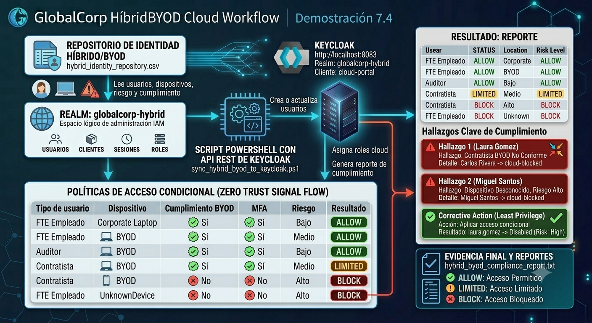
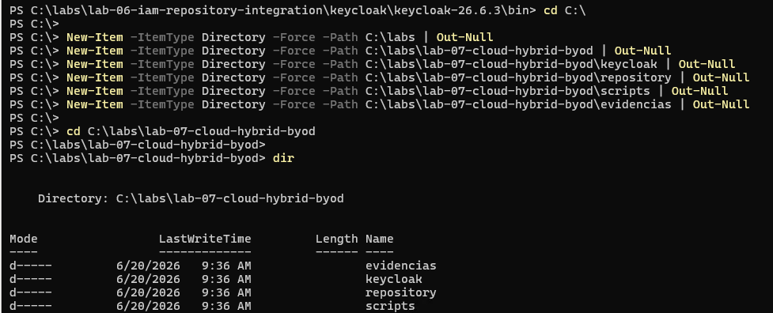
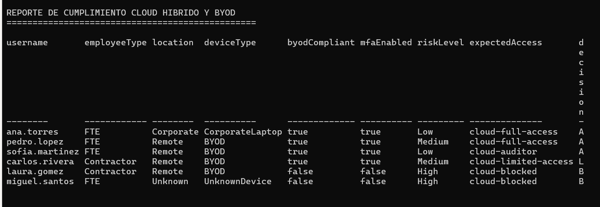

# Demostración 7.4: Escenario de acceso cloud/híbrido con identidad federada


  
**Duración de la demostración:** 25 minutos  


---

## Objetivos del capítulo

Crear políticas híbridas cloud/on-premise y BYOD que cumplan requisitos de auditoría, privacidad y continuidad del negocio.

---

## Objetivos de la demostración

Al finalizar esta demostración, serás capaz de:

- Simular un escenario de acceso cloud/híbrido con identidad federada.
- Usar Keycloak como plataforma IAM demostrativa.
- Crear un realm dedicado para un escenario híbrido.
- Crear una aplicación cloud simulada.
- Crear roles de acceso cloud.
- Simular usuarios internos, contratistas y usuarios BYOD.
- Evaluar condiciones de acceso basadas en dispositivo, MFA, riesgo y cumplimiento BYOD.
- Crear usuarios en Keycloak desde un repositorio CSV usando la API REST administrativa.
- Generar evidencia de auditoría y cumplimiento.

---

## Objetivo visual


---

## Tabla de ayuda

| Elemento | Valor |
|---|---|
| Plataforma | Windows Server en máquina virtual de Azure |
| Terminal | Windows PowerShell |
| Herramienta IAM | Keycloak |
| Puerto de Keycloak | `8083` |
| Realm | `globalcorp-hybrid` |
| Cliente cloud | `cloud-portal` |
| Repositorio simulado | `hybrid_identity_repository.csv` |
| Script principal | `sync_hybrid_byod_to_keycloak.ps1` |
| Método de integración | API REST administrativa de Keycloak |
| Reporte final | `hybrid_byod_compliance_report.txt` |

---

## Aviso importante para el participante

Esta demostración es independiente de laboratorios anteriores.

Si no completaste prácticas anteriores con Keycloak, ejecuta desde el inicio. Si ya tienes Java instalado, puedes saltar la instalación y validar únicamente con:

```powershell
java -version
```

Si Java responde correctamente, continúa con la descarga o ejecución de Keycloak.

> Nota importante: esta demostración usa la API REST administrativa de Keycloak desde PowerShell. No se usa `kcadm.bat` para crear usuarios ni asignar roles, porque en algunos entornos puede generar errores de parseo JSON o problemas con archivos temporales. La API REST es más estable para esta práctica.

---

# Escenario

GlobalCorp tiene una aplicación cloud llamada `cloud-portal`. La empresa permite acceso desde equipos corporativos y dispositivos BYOD, pero necesita aplicar controles de seguridad.

Las reglas de acceso son:

| Tipo de usuario | Dispositivo | Cumplimiento BYOD | MFA | Riesgo | Resultado |
|---|---|---|---|---|---|
| Empleado FTE | CorporateLaptop | Sí | Sí | Bajo | ALLOW |
| Empleado FTE | BYOD | Sí | Sí | Medio | ALLOW |
| Auditor | BYOD | Sí | Sí | Bajo | ALLOW |
| Contratista | BYOD | Sí | Sí | Medio | LIMITED |
| Contratista | BYOD | No | No | Alto | BLOCK |
| Usuario FTE | UnknownDevice | No | No | Alto | BLOCK |

---

# Instrucciones

---

## Tarea 1. Crear carpeta de la demostración

Abre **Windows PowerShell como administrador** y ejecuta:

```powershell
cd C:\

New-Item -ItemType Directory -Force -Path C:\labs | Out-Null
New-Item -ItemType Directory -Force -Path C:\labs\lab-07-cloud-hybrid-byod | Out-Null
New-Item -ItemType Directory -Force -Path C:\labs\lab-07-cloud-hybrid-byod\keycloak | Out-Null
New-Item -ItemType Directory -Force -Path C:\labs\lab-07-cloud-hybrid-byod\repository | Out-Null
New-Item -ItemType Directory -Force -Path C:\labs\lab-07-cloud-hybrid-byod\scripts | Out-Null
New-Item -ItemType Directory -Force -Path C:\labs\lab-07-cloud-hybrid-byod\evidencias | Out-Null

cd C:\labs\lab-07-cloud-hybrid-byod

dir
```

Resultado esperado:




---

## Tarea 2. Validar o instalar Java

Ejecuta:

```powershell
java -version
```

Si Java está instalado, verás algo similar a:

```text
openjdk version "21..."
```

Si no está instalado, ejecuta:

```powershell
winget search temurin
winget install --id EclipseAdoptium.Temurin.21.JDK -e
```

Si solicita confirmación, responde:

```text
Y
```

Después cierra PowerShell, abre una nueva ventana como administrador y valida:

```powershell
java -version
```

---

## Tarea 3. Descargar Keycloak

Ejecuta:

```powershell
cd C:\labs\lab-07-cloud-hybrid-byod\keycloak

$KeycloakVersion = "26.6.3"
$KeycloakZip = "keycloak-$KeycloakVersion.zip"
$KeycloakUrl = "https://github.com/keycloak/keycloak/releases/download/$KeycloakVersion/$KeycloakZip"

Invoke-WebRequest -Uri $KeycloakUrl -OutFile $KeycloakZip

Expand-Archive -Path $KeycloakZip -DestinationPath . -Force

dir
```

Resultado esperado:

```text
keycloak-26.6.3
keycloak-26.6.3.zip
```

---

## Tarea 4. Iniciar Keycloak en el puerto 8083

Ejecuta:

```powershell
cd C:\labs\lab-07-cloud-hybrid-byod\keycloak\keycloak-26.6.3

$env:KC_BOOTSTRAP_ADMIN_USERNAME="admin"
$env:KC_BOOTSTRAP_ADMIN_PASSWORD="Admin123!"

.\bin\kc.bat start-dev --http-port=8083
```

Resultado esperado:

```text
Keycloak started
```

O también:

```text
Listening on: http://0.0.0.0:8083
```

> No cierres esta ventana. Si la cierras, Keycloak se detendrá.

---

## Tarea 5. Entrar a Keycloak

Abre el navegador dentro de la VM y entra a:

```text
http://localhost:8083
```

Luego entra a:

```text
Administration Console
```

Usa estas credenciales:

```text
Usuario: admin
Contraseña: Admin123!
```

---

## Tarea 6. Crear el realm `globalcorp-hybrid`

En la consola de Keycloak:

1. Abre el selector de realm.
2. Entra a **Manage realms**.
3. Selecciona **Create realm**.
4. En **Realm name**, escribe:

```text
globalcorp-hybrid
```

5. Da clic en **Create**.

Resultado esperado:

```text
globalcorp-hybrid
Current realm
```

---

## Tarea 7. Crear el cliente cloud `cloud-portal`

Dentro del realm `globalcorp-hybrid`, entra a:

```text
Clients
```

Da clic en:

```text
Create client
```

Completa:

```text
Client type: OpenID Connect
Client ID: cloud-portal
Name: Cloud Portal
Description: Aplicación cloud simulada para acceso híbrido y BYOD
```

Da clic en **Next**.

Configura capacidades:

```text
Client authentication: Off
Authorization: Off
Standard flow: On
Direct access grants: On
Implicit flow: Off
Service accounts roles: Off
```

Da clic en **Next**.

Configura URLs:

```text
Root URL: http://localhost:7200
Home URL: http://localhost:7200
Valid redirect URIs: http://localhost:7200/*
Valid post logout redirect URIs: http://localhost:7200/*
Web origins: http://localhost:7200
```

Da clic en **Save**.

Resultado esperado:

```text
cloud-portal
```

---

## Tarea 8. Crear roles del cliente `cloud-portal`

Entra a:

```text
Clients > cloud-portal > Roles
```

Crea los siguientes roles:

```text
Role name: cloud-full-access
Description: Acceso completo a la aplicación cloud para empleados corporativos.
```

```text
Role name: cloud-limited-access
Description: Acceso limitado para contratistas o usuarios BYOD aprobados.
```

```text
Role name: cloud-auditor
Description: Acceso de auditoría y revisión de cumplimiento.
```

```text
Role name: cloud-blocked
Description: Acceso bloqueado por incumplimiento de política BYOD o riesgo híbrido.
```

Resultado esperado:


---

## Tarea 9. Crear repositorio híbrido/BYOD

Abre una nueva ventana de PowerShell. No cierres la ventana donde Keycloak está corriendo.

Ejecuta:

```powershell
cd C:\labs\lab-07-cloud-hybrid-byod\repository

@"
username,email,firstName,lastName,employeeType,location,deviceType,byodCompliant,mfaEnabled,riskLevel,expectedAccess
ana.torres,ana@globalcorp.com,Ana,Torres,FTE,Corporate,CorporateLaptop,true,true,Low,cloud-full-access
pedro.lopez,pedro@globalcorp.com,Pedro,Lopez,FTE,Remote,BYOD,true,true,Medium,cloud-full-access
sofia.martinez,sofia@globalcorp.com,Sofia,Martinez,FTE,Remote,BYOD,true,true,Low,cloud-auditor
carlos.rivera,carlos@globalcorp.com,Carlos,Rivera,Contractor,Remote,BYOD,true,true,Medium,cloud-limited-access
laura.gomez,laura@globalcorp.com,Laura,Gomez,Contractor,Remote,BYOD,false,false,High,cloud-blocked
miguel.santos,miguel@globalcorp.com,Miguel,Santos,FTE,Unknown,UnknownDevice,false,false,High,cloud-blocked
"@ | Set-Content -Path .\hybrid_identity_repository.csv -Encoding UTF8

type .\hybrid_identity_repository.csv
```

Resultado esperado:


---

## Tarea 10. Crear el script de integración híbrida/BYOD

Este script usa la **API REST administrativa de Keycloak** para evitar problemas de parseo JSON con `kcadm.bat`.

Ejecuta:

```powershell
cd C:\labs\lab-07-cloud-hybrid-byod\scripts

@'
$ErrorActionPreference = "Stop"

$BasePath = "C:\labs\lab-07-cloud-hybrid-byod"
$RepositoryFile = "$BasePath\repository\hybrid_identity_repository.csv"
$ReportFile = "$BasePath\evidencias\hybrid_byod_compliance_report.txt"

$Server = "http://localhost:8083"
$AdminRealm = "master"
$TargetRealm = "globalcorp-hybrid"
$AdminUser = "admin"
$AdminPassword = "Admin123!"
$ClientId = "cloud-portal"

Write-Host "Obteniendo token administrativo..." -ForegroundColor Cyan

$TokenResponse = Invoke-RestMethod `
    -Method Post `
    -Uri "$Server/realms/$AdminRealm/protocol/openid-connect/token" `
    -ContentType "application/x-www-form-urlencoded" `
    -Body @{
        grant_type = "password"
        client_id = "admin-cli"
        username = $AdminUser
        password = $AdminPassword
    }

$AccessToken = $TokenResponse.access_token

$Headers = @{
    Authorization = "Bearer $AccessToken"
}

Write-Host "Buscando cliente $ClientId..." -ForegroundColor Cyan

$Clients = Invoke-RestMethod `
    -Method Get `
    -Uri "$Server/admin/realms/$TargetRealm/clients?clientId=$ClientId" `
    -Headers $Headers

$ClientUuid = $Clients[0].id

$Users = Import-Csv $RepositoryFile
$Report = @()

foreach ($User in $Users) {
    Write-Host "Procesando usuario $($User.username)..." -ForegroundColor Yellow

    $EnabledValue = $true

    if ($User.expectedAccess -eq "cloud-blocked") {
        $EnabledValue = $false
    }

    $ExistingUsers = Invoke-RestMethod `
        -Method Get `
        -Uri "$Server/admin/realms/$TargetRealm/users?username=$($User.username)&exact=true" `
        -Headers $Headers

    $UserPayload = @{
        username = $User.username
        email = $User.email
        firstName = $User.firstName
        lastName = $User.lastName
        enabled = $EnabledValue
        attributes = @{
            employeeType = @($User.employeeType)
            location = @($User.location)
            deviceType = @($User.deviceType)
            byodCompliant = @($User.byodCompliant)
            mfaEnabled = @($User.mfaEnabled)
            riskLevel = @($User.riskLevel)
            expectedAccess = @($User.expectedAccess)
        }
    }

    $UserJson = $UserPayload | ConvertTo-Json -Depth 10

    if ($ExistingUsers.Count -eq 0) {
        Invoke-RestMethod `
            -Method Post `
            -Uri "$Server/admin/realms/$TargetRealm/users" `
            -Headers $Headers `
            -ContentType "application/json" `
            -Body $UserJson

        $Action = "CREATED"
    }
    else {
        $UserId = $ExistingUsers[0].id

        Invoke-RestMethod `
            -Method Put `
            -Uri "$Server/admin/realms/$TargetRealm/users/$UserId" `
            -Headers $Headers `
            -ContentType "application/json" `
            -Body $UserJson

        $Action = "UPDATED"
    }

    $CreatedUsers = Invoke-RestMethod `
        -Method Get `
        -Uri "$Server/admin/realms/$TargetRealm/users?username=$($User.username)&exact=true" `
        -Headers $Headers

    if ($CreatedUsers.Count -eq 0) {
        throw "El usuario $($User.username) no fue creado correctamente."
    }

    $UserId = $CreatedUsers[0].id

    if ($EnabledValue -eq $true) {
        $PasswordPayload = @{
            type = "password"
            value = "Password123!"
            temporary = $false
        } | ConvertTo-Json

        Invoke-RestMethod `
            -Method Put `
            -Uri "$Server/admin/realms/$TargetRealm/users/$UserId/reset-password" `
            -Headers $Headers `
            -ContentType "application/json" `
            -Body $PasswordPayload
    }

    $Role = Invoke-RestMethod `
        -Method Get `
        -Uri "$Server/admin/realms/$TargetRealm/clients/$ClientUuid/roles/$($User.expectedAccess)" `
        -Headers $Headers

    $RolePayload = @(
        @{
            id = $Role.id
            name = $Role.name
        }
    ) | ConvertTo-Json -Depth 10

    try {
        Invoke-RestMethod `
            -Method Post `
            -Uri "$Server/admin/realms/$TargetRealm/users/$UserId/role-mappings/clients/$ClientUuid" `
            -Headers $Headers `
            -ContentType "application/json" `
            -Body $RolePayload
    }
    catch {
        Write-Host "El rol ya estaba asignado o no requiere reasignacion: $($User.username)" -ForegroundColor DarkYellow
    }

    $Decision = "ALLOW"

    if ($User.expectedAccess -eq "cloud-limited-access") {
        $Decision = "LIMITED"
    }

    if ($User.expectedAccess -eq "cloud-blocked") {
        $Decision = "BLOCK"
    }

    $Report += [PSCustomObject]@{
        username = $User.username
        employeeType = $User.employeeType
        location = $User.location
        deviceType = $User.deviceType
        byodCompliant = $User.byodCompliant
        mfaEnabled = $User.mfaEnabled
        riskLevel = $User.riskLevel
        expectedAccess = $User.expectedAccess
        decision = $Decision
        keycloakEnabled = $EnabledValue
        action = $Action
    }
}

$ReportText = $Report | Format-Table -AutoSize | Out-String

"REPORTE DE CUMPLIMIENTO CLOUD HIBRIDO Y BYOD" | Set-Content -Path $ReportFile -Encoding UTF8
"================================================" | Add-Content -Path $ReportFile -Encoding UTF8
$ReportText | Add-Content -Path $ReportFile -Encoding UTF8

Write-Host ""
Write-Host "Integracion hibrida finalizada." -ForegroundColor Green
Write-Host "Reporte generado en: $ReportFile" -ForegroundColor Green
Write-Host ""
Get-Content $ReportFile
'@ | Set-Content -Path .\sync_hybrid_byod_to_keycloak.ps1 -Encoding UTF8
```

Validar:

```powershell
dir .\sync_hybrid_byod_to_keycloak.ps1
```

---

## Tarea 11. Ejecutar la integración híbrida/BYOD

Ejecuta:

```powershell
cd C:\labs\lab-07-cloud-hybrid-byod\scripts

.\sync_hybrid_byod_to_keycloak.ps1
```

Resultado esperado:

```text
Obteniendo token administrativo...
Buscando cliente cloud-portal...
Procesando usuario ana.torres...
Procesando usuario pedro.lopez...
Procesando usuario sofia.martinez...
Procesando usuario carlos.rivera...
Procesando usuario laura.gomez...
Procesando usuario miguel.santos...

Integracion hibrida finalizada.
Reporte generado en: C:\labs\lab-07-cloud-hybrid-byod\evidencias\hybrid_byod_compliance_report.txt
```

El reporte debe mostrar:

```text
ana.torres       ALLOW
pedro.lopez      ALLOW
sofia.martinez   ALLOW
carlos.rivera    LIMITED
laura.gomez      BLOCK
miguel.santos    BLOCK
```


---

## Tarea 12. Validar usuarios en Keycloak

En el navegador, dentro del realm `globalcorp-hybrid`, entra a:

```text
Users
```

Presiona **Refresh**.

Resultado esperado:

```text
1 - 6
```

Deben aparecer:

```text
ana.torres
pedro.lopez
sofia.martinez
carlos.rivera
laura.gomez
miguel.santos
```

Los siguientes usuarios deben aparecer deshabilitados:

```text
laura.gomez
miguel.santos
```

Esto representa usuarios bloqueados por incumplimiento BYOD o riesgo alto.


---

## Tarea 13. Validar roles de acceso

Abre cada usuario y entra a:

```text
Role mapping
```

Valida los roles esperados:

| Usuario | Rol esperado |
|---|---|
| `ana.torres` | `cloud-full-access` |
| `pedro.lopez` | `cloud-full-access` |
| `sofia.martinez` | `cloud-auditor` |
| `carlos.rivera` | `cloud-limited-access` |
| `laura.gomez` | `cloud-blocked` |
| `miguel.santos` | `cloud-blocked` |

Si no ves los roles inmediatamente, usa el filtro:

```text
Filter by clients
```

---

## Tarea 14. Revisar evidencia final

Ejecuta:

```powershell
type C:\labs\lab-07-cloud-hybrid-byod\evidencias\hybrid_byod_compliance_report.txt
```

Resultado esperado:

```text
REPORTE DE CUMPLIMIENTO CLOUD HIBRIDO Y BYOD
================================================
```

Debe mostrar los usuarios, su nivel de riesgo y la decisión de acceso:

```text
ALLOW
LIMITED
BLOCK
```

---

## Interpretación de resultados

| Usuario | Interpretación |
|---|---|
| `ana.torres` | Empleada interna con equipo corporativo. Acceso permitido. |
| `pedro.lopez` | Empleado remoto con BYOD conforme y MFA. Acceso permitido. |
| `sofia.martinez` | Usuaria auditora con BYOD conforme. Acceso permitido con rol auditor. |
| `carlos.rivera` | Contratista remoto con BYOD conforme. Acceso limitado. |
| `laura.gomez` | Contratista con BYOD no conforme y sin MFA. Acceso bloqueado. |
| `miguel.santos` | Usuario con dispositivo desconocido, sin cumplimiento y sin MFA. Acceso bloqueado. |

---

## Evidencias a capturar

Captura las siguientes evidencias:

1. Realm `globalcorp-hybrid` creado.
2. Cliente `cloud-portal` creado.
3. Roles cloud creados.
4. Archivo `hybrid_identity_repository.csv` creado.
5. Ejecución exitosa del script.
6. Reporte `hybrid_byod_compliance_report.txt`.
7. Lista de usuarios en Keycloak mostrando `1 - 6`.
8. Usuarios `laura.gomez` y `miguel.santos` en estado `Disabled`.
9. Roles asignados por usuario.

---

## ¿Sabías que...?

En escenarios reales de Cloud IAM y BYOD, una decisión de acceso no debería depender únicamente del usuario y contraseña.

También deben considerarse señales como:

- Tipo de dispositivo.
- Cumplimiento de postura de seguridad.
- MFA habilitado.
- Ubicación.
- Nivel de riesgo.
- Tipo de empleado.
- Relación contractual.
- Sensibilidad de la aplicación.

Esto permite aplicar modelos de acceso condicional y Zero Trust.

---

## Solución de problemas

### Error: no abre `http://localhost:8083`

Keycloak no está corriendo o la ventana fue cerrada.

Solución:

```powershell
cd C:\labs\lab-07-cloud-hybrid-byod\keycloak\keycloak-26.6.3

$env:KC_BOOTSTRAP_ADMIN_USERNAME="admin"
$env:KC_BOOTSTRAP_ADMIN_PASSWORD="Admin123!"

.\bin\kc.bat start-dev --http-port=8083
```

---

### Error: `java is not recognized`

Java no está instalado o PowerShell no cargó el PATH actualizado.

Solución:

```powershell
winget install --id EclipseAdoptium.Temurin.21.JDK -e
```

Cierra y abre PowerShell nuevamente. Luego valida:

```powershell
java -version
```

---

### Error con `kcadm.bat`, JSON o `Cannot deserialize value`

Esta versión del laboratorio no usa `kcadm.bat` para crear usuarios ni asignar roles.

Solución:

Usa el script de la **Tarea 10**, basado en la API REST administrativa de Keycloak.

---

### Solo aparece un usuario en Keycloak

Causa probable:

Se ejecutó una versión anterior del script que usaba `kcadm.bat` o JSON temporal.

Solución:

1. Reemplaza el script con la versión REST de la **Tarea 10**.
2. Ejecuta nuevamente:

```powershell
cd C:\labs\lab-07-cloud-hybrid-byod\scripts

.\sync_hybrid_byod_to_keycloak.ps1
```

3. Presiona **Refresh** en `Users`.

---

## Actividad de cierre

Responde:

1. ¿Qué representa el realm `globalcorp-hybrid`?
2. ¿Qué representa el cliente `cloud-portal`?
3. ¿Por qué `laura.gomez` y `miguel.santos` quedan deshabilitados?
4. ¿Qué diferencia hay entre `ALLOW`, `LIMITED` y `BLOCK`?
5. ¿Qué señales BYOD se usaron para evaluar el acceso?
6. ¿Por qué MFA es importante en escenarios híbridos?
7. ¿Por qué un usuario contratista puede recibir acceso limitado?
8. ¿Qué evidencia genera el archivo `hybrid_byod_compliance_report.txt`?
9. ¿Qué relación tiene esta demostración con auditoría y cumplimiento?
10. ¿Por qué la API REST de Keycloak es útil para automatizar IAM?

---

## Respuestas esperadas

1. Representa un dominio de identidad para el escenario cloud/híbrido.
2. Representa una aplicación cloud simulada protegida por IAM.
3. Porque no cumplen la política BYOD o presentan riesgo alto.
4. `ALLOW` permite acceso, `LIMITED` restringe acceso y `BLOCK` bloquea el acceso.
5. Tipo de dispositivo, cumplimiento BYOD, MFA, ubicación, riesgo y tipo de empleado.
6. Porque reduce el riesgo de compromiso de credenciales.
7. Porque su relación contractual puede requerir menor privilegio.
8. Evidencia de decisiones de acceso y cumplimiento.
9. Permite demostrar quién tiene acceso, bajo qué condiciones y con qué nivel de riesgo.
10. Porque permite integrar Keycloak con procesos automatizados, repositorios externos y flujos de gobierno de identidad.

---

## Conclusiones

En esta demostración se construyó un escenario cloud/híbrido con identidad federada y políticas BYOD.

Se demostró que una solución IAM puede integrar señales de identidad, dispositivo, cumplimiento y riesgo para tomar decisiones de acceso.

Los puntos clave fueron:

- Keycloak puede representar una plataforma IAM en escenarios híbridos.
- Un repositorio externo puede alimentar usuarios y atributos.
- Las políticas BYOD deben considerar cumplimiento, MFA y riesgo.
- Los usuarios no conformes pueden bloquearse mediante deshabilitación de cuenta.
- Los contratistas pueden recibir acceso limitado.
- La API REST de Keycloak permite automatizar aprovisionamiento y asignación de roles.
- El reporte generado funciona como evidencia de auditoría y cumplimiento.

### Fin de la demostración 7.4
